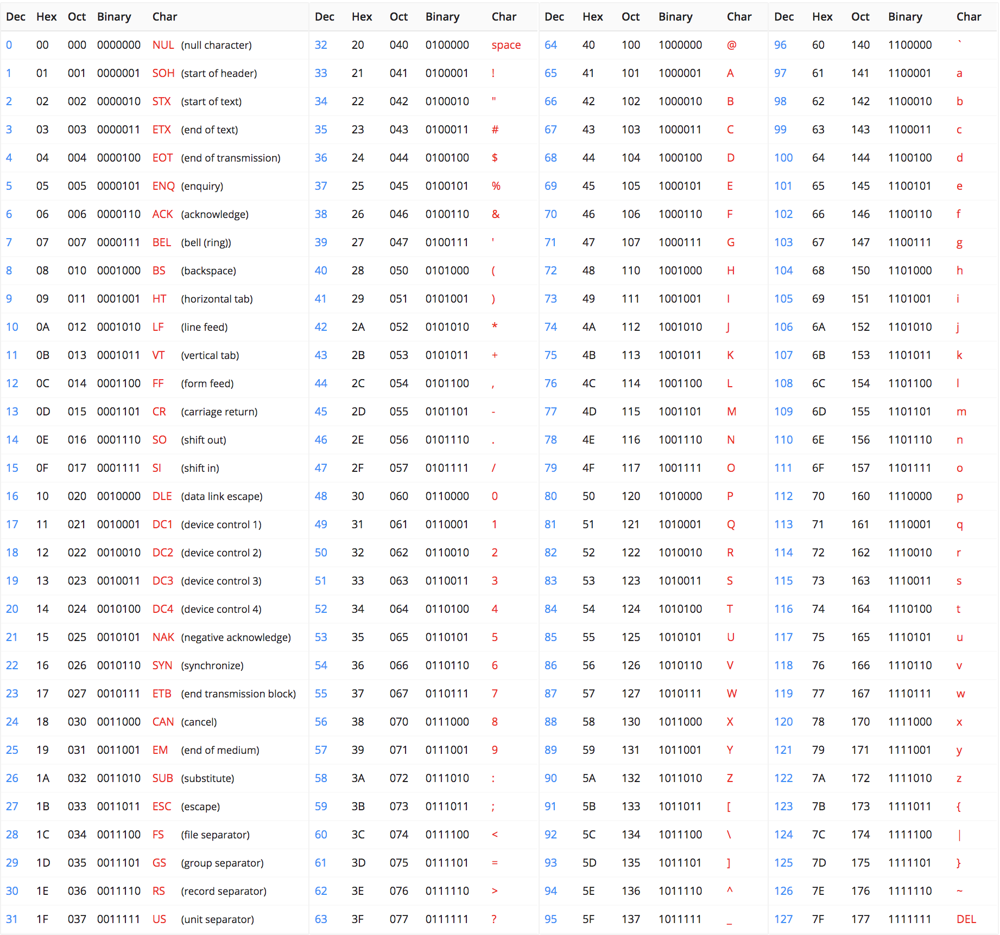
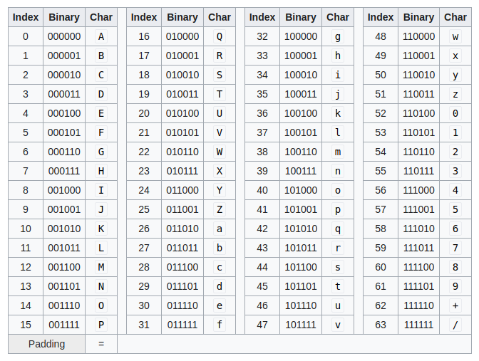

# Common Bases

Data can be expressed in a variety of common numerical bases including base 2 (binary), 10 (decimal), 16 (hexadecimal), and 64 (base64). While expressing data in some base n is not *inherently* cryptographic in nature as it is not designed to necessarily secure data, it is oftentimes included under the umbrella of cryptography.

**The base merely refers to how many possible values a single digit can represent.** For example, a base 2 digit can only represent 2 possible values. A base 64 digit can only represent 64 possible values. Bases are more commonly used to express data or encode data as opposed to *encrypt* data, again going back to the important distinction that must be made that the contents of this article are not technically about actual cryptography.

## ASCII

Before diving into these common bases, we must first understand the **American Standard Code for Information Interchange (ASCII)**. ASCII is an encoding standard that allows for numbers to represent characters. For example, in ASCII, the decimal number that we would know as 97 can be used to represent the character "a" on a computer.

The following ASCII table may be used as a reference.



(Courtesy: asciitable.xyz)

ASCII is important because it sets a standard for how to express characters on a computer. It prevents different two systems from arguing over what character the binary `01100001` represents by setting the standard for the both of them.

## Base 2 (Binary)

**Binary** is perhaps the most important numerical base to a computer as it is actually the only base that a computer understands at a fundamental level. In binary, a digit can only represent two possible values: 0, or 1. Each value is known as a binary digit, or bit for short. A 0 bit is most commonly thought of as an electrical low state while a 1 bit is most commonly thought of as an electrical high state.

In order to convert a decimal number to binary, simply express the decimal number in powers of two and then collect the multipliers. For example, suppose that we want to convert the decimal number 65 to binary.

65 = (1)2^6 + (0)2^5 + (0)2^4 + (0)2^3 + (0)2^2 + (0)2^1 + (1)2^0

After collecting the multipliers, we are left with 1000001. Thus, we can say that decimal 65 is equivalent to binary 1000001, or in shorter notation. 0d65 = 0b1000001.

## Base 10 (Decimal)

**Decimal** is the most familiar base to most people because it's the base that we naturally count in. We humans allow a single digit to represent ten possible values: 0 through 9. When you think of a number, chances are that you're thinking of a decimal number.

## Base 16 (Hexadecimal)

**Hexadecimal** is an important base to be acquainted with as it is commonly used to represent bytes in computers. Hexadecimal has 16 possible values that a single digit can represent: 0 through 9, and then a through f. This allows a single hexadecimal digit to represent decimal values from 0 to 15.

A standard byte consists of 8 bits. If a byte were to split in half into 2 nibbles, then it can be observed that each nibble can only represent decimal values from 0 to 15. This means that a single byte can be conveniently represented with 2 nibbles.

Consider the following byte: `11010101`. This byte can be split into the nibbles `1101` and `0101`. The decimal value of the first nibble is (1)2^3 + (1)2^2 + (0)2^1 + (1)2^0, or 13. The decimal value of the second nibble is (0)2^3 + (1)2^2 + (0)2^1 + (1)2^0, or 5.

In hexadecimal, decimal values beyond 9 are represented using letters. 10 is a, 11 is b, 12 is c, 13 is d, 14 is e, and 15 is f. In the first step, we divided the byte into 4-bit nibbles and then calculated their decimal values. Now, we can assign hexadecimal representations to these nibbles based off of their decimal values. Decimal 13 is hexadecimal d and decimal 5 is hexadecimal 5, or 0d13 = 0xd and 0d5 = 0x5.

Piecing it all together, we can say that 0b11010101 = 0xd5.

To reiterate, hexadecimal is incredibly convenient for representing 8-bit bytes with only two digits.

## Base 64 (Base64)

**Base64** is another base to know particularly due to its importance and usage in web technologies. In base64, there are 64 possible values that a single digit can represent. **All 64 possible values that a base64 digit can represent are ASCII and web-safe.** This allows any sort of data to be encoded and safely transmitted across the web.

The following base64 table may be used as a reference.



While base64 could be converted by hand, it's oftentimes much easier to just use the `base64` command-line utility available on Linux systems.

In order to encode some data in base64, pipe the data into `base64`. For example:

```
$ echo "Hello world!" | base64
$ cat file.dat | base64
```

In order to decode some base64 data, do the same but pass the `-d` flag. For example:

```
$ echo "SGVsbG8gd29ybGQhCg==" | base64 -d
$ cat file.b64 | base64 -d
```

The advantage of base64 is that it can express any kind of binary data using the characters available on a standard keyboard which also happen to be guaranteed to be web-safe, meaning that base64 data can be used to safely encode data, send data, and decode data without data loss due to formatting.
