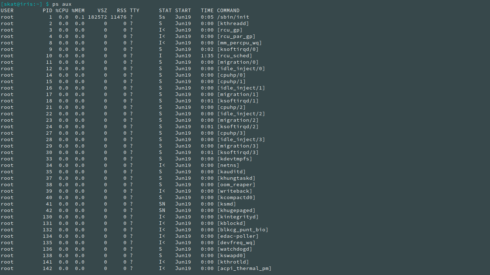
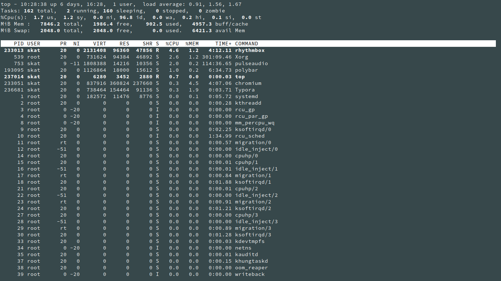

# System Monitoring

While system monitoring may not be on the minds of regular Linux desktop users, it is definitely on the minds of those who serve as system administrators for larger scale Linux systems such as servers and mainframes. This article will be covering three common tasks related to system monitoring that a system administrator often performs: **monitoring resources, monitoring the filesystem, and monitoring users.**

## Monitoring Resources

`ps` (processes) is the most basic utility for resource monitoring. Using `ps` in `aux` mode (see: [Commands to Know](./commands-to-know.md)) can list all of the processes running on the system complete with the user they are running as, their PID, CPU and memory usage, and other information.



`top` is a useful program that displays information such as the uptime, number of users, CPU usage, memory usage, and other things as well as a live and updating list of programs and their individual resource usage. You can use SHIFT+M to sort by memory or SHIFT+P to sort by CPU usage, among many other features.



## Monitoring the Filesystem

`df` (disk free) is a useful utility that displays the amount of free space left on all disks. This includes how much of the disk has been used, how much is available, and a percentage of the disk's usage, as well as where the disk is mounted. Using `-h` can display all values in a more human-readable format.

```
[skat@iris:~] $ df -h
Filesystem      Size  Used Avail Use% Mounted on
dev             3.9G     0  3.9G   0% /dev
run             3.9G  1.1M  3.9G   1% /run
/dev/sda2        32G   21G  9.2G  70% /
tmpfs           3.9G  159M  3.7G   5% /dev/shm
tmpfs           3.9G     0  3.9G   0% /sys/fs/cgroup
tmpfs           3.9G   96K  3.9G   1% /tmp
/dev/sda3        78G   18G   57G  24% /home
tmpfs           785M   24K  785M   1% /run/user/1000
```

## Monitoring Users

The `ps` utility can be used to monitor what sorts of processes a user is running when using the `-u <user>` argument.

```
[skat@iris:~] $ ps -u skat
    PID TTY          TIME CMD
    711 ?        00:00:00 systemd
    712 ?        00:00:00 (sd-pam)
    717 ?        00:01:11 i3
    721 ?        00:00:06 dbus-daemon
    723 ?        00:00:00 xss-lock
    731 ?        02:17:50 compton
    735 ?        00:03:52 unclutter
    753 ?        01:55:21 pulseaudio
    759 ?        00:00:00 gsettings-helpe
   1297 ?        00:00:00 at-spi-bus-laun
   1303 ?        00:00:17 dbus-daemon
   1307 ?        00:00:00 dconf-service
   1311 ?        00:01:24 at-spi2-registr
  29284 ?        00:03:57 unclutter
 193093 ?        00:00:00 sh
 193095 ?        00:06:50 polybar
 233013 ?        00:05:57 rhythmbox
 233034 ?        00:05:54 cool-retro-term
 233042 pts/0    00:00:00 bash
 233051 ?        00:05:09 chromium
```

`who` can be used to see who is currently logged into the system. This includes remote connections such as SSH connections. This also displays when they logged in.

```
[skat@iris:~] $ who
skat     tty7         Jun 19 17:59 (:0)
```

`w` is another program that is similar to `who`, but is much more detailed and lists things such as what it is that the user is currently doing.

```
[skat@iris:~] $ w
 11:05:34 up 6 days, 17:05,  1 user,  load average: 1.22, 1.40, 1.38
USER     TTY        LOGIN@   IDLE   JCPU   PCPU WHAT
skat     tty7      19Jun20  6days  5:04m  1:11  i3 -a --restart /run/user/1000/i3/restart-state.717
```
