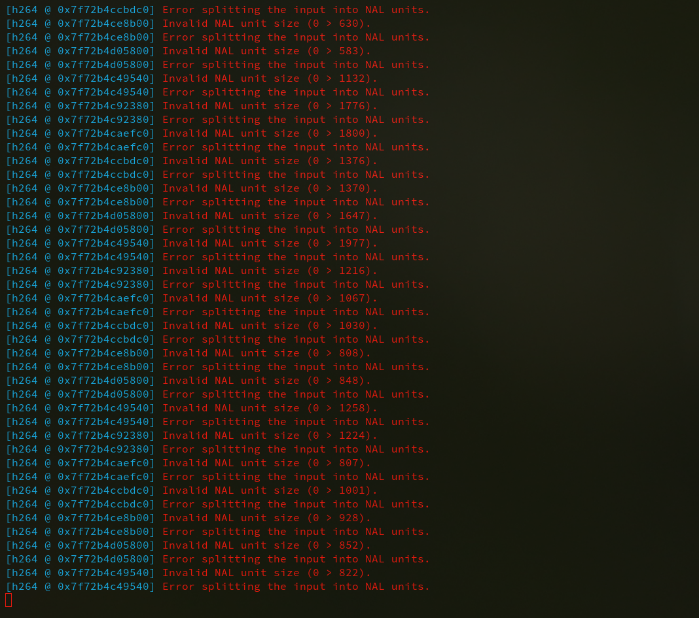
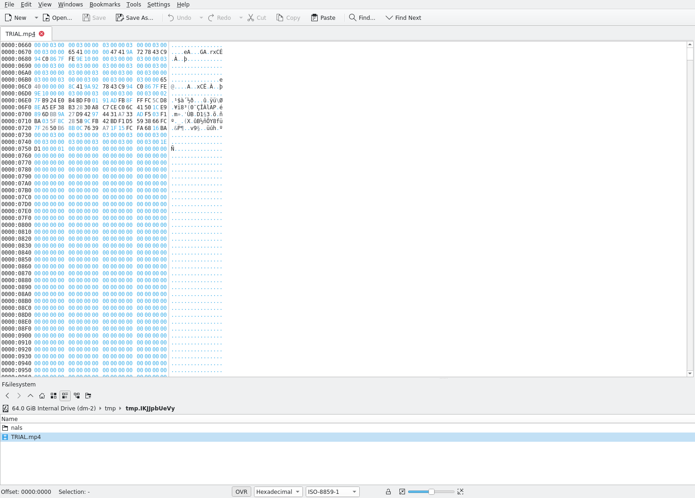
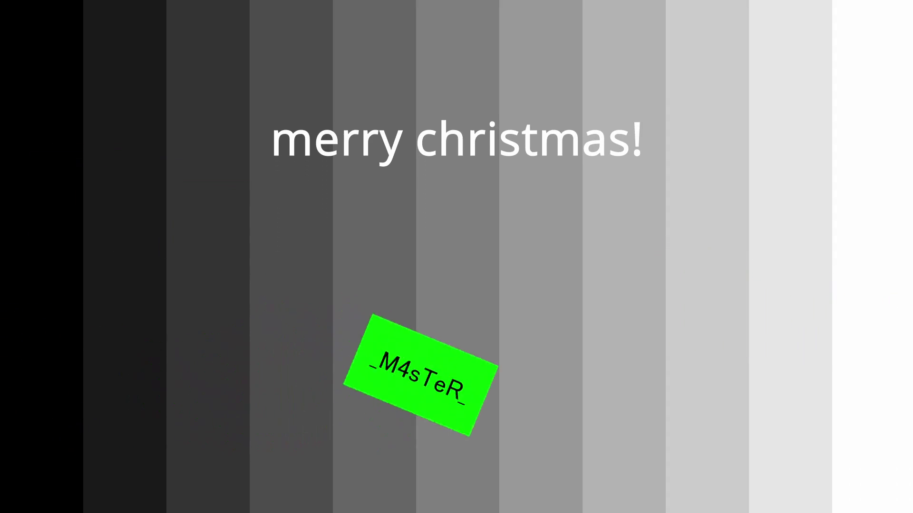
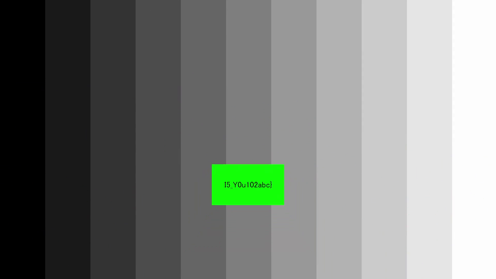

# X-MAS CTF 2021

*This writeup is also readable on my [personal website](https://shawnd.xyz/blog/2022-02-17/Performing-NAL-Transplants-to-Recover-Corrupted-Media) and [team website](https://irissec.xyz/articles/categories/forensics/2022-02-17/Performing-NAL-Transplants-to-Recover-Corrupted-Media).*

Last December, I had a lot of fun competing at X-Mas CTF 2022 hosted by Hecării, Țuica și Păunii with my team IrisSec. We ranked 2nd place out of 982 teams globally. HTsP really knows how to throw a great CTF with no shortage of interesting and diverse challenges! One of the challenges I did was a forensics challenge involving a corrupted file which, although originally meant to only be a first weekend challenge, the event organizers decided it was apparently so difficult that they extended it to span the entire duration of the 9-day event. We were the only team that managed to solve it during the original time frame and frankly, it was a really easy challenge.

All files can be found in the [xmas directory](./files/2021-xmas/).

## forensics/NALcromancer

We're given a ZIP file containing an MP4 file and a directory `nals/` full of files `nal_2`, `nal_3`, ...

**Files:** `TRIAL.zip`

Checksums (SHA-1):

```
bfbd743e552605625255d25cab3fe851aba3f1bd  TRIAL.zip
```

```
[skat@anubis:/tmp/tmp.IKJJpbUeVy] $ tree
.
├── nals
│   ├── nal_10
│   ├── nal_11
│   ├── nal_12
│   ├── nal_13
│   ├── nal_14
--snip--
└── TRIAL.mp4

1 directory, 48 files
```

Upon trying to view `TRIAL.mp4`, we get a video with not much happening:


The color eventually changes and some animated waves are shown. What's interesting is that if you try to revert back to before the color change and wave animations, the video will be stuck on the last frame shown before you reverted back in time:


All of this is happening while VLC is spitting out error messages about NALs:



For the uninitiated, NAL is short for "network abstraction layer" and basically allows for video to be represented in a network-friendly format in the form of NAL units -- packets. You can read more about NALs here: [Wikipedia](https://en.wikipedia.org/wiki/Network_Abstraction_Layer).

Immediately, I had an idea:


If my suspicion was correct, the video is essentially missing its NALs and we just need to transplant the NALs from the given `nals/` directory into the video. Therefore, if I were to open up the video in its current, corrupted state within a hex editor, I should expect to see missing NALs:



What are still present, however, are what I presume to be synchronization markers. Thus, NALs have null bytes in their place but the markers that separate the NALs are still present. If I were to append the given NALs with the present markers in a NAL-marker-NAL-marker-... pattern, I could just transplant\* the resulting compiled NALs directly into the video file in a program such as a hex editor to repair it.

\* Copy-paste.

The following Python code will compile the given NALs with the present markers and write them to a file `nal_2-48`:


```python
#!/usr/bin/env python3

def main():

    markers = []

    # Markers are only from 0x750 to 0x48675 (inclusive).
    with open("./TRIAL.mp4", "rb") as f:
        stream = f.read()[0x750:0x48676]

    while len(stream) > 0:
        if stream[0] != 0x00:
            markers.append(stream[0:4])
            stream = stream[4:]
        else:
            stream = stream[1:]

    output = b""

    for i in range(2, 48+1):
        with open(f"./nals/nal_{i}", "rb") as f:
            nal = f.read()
            output += markers.pop(0)
            output += nal

    with open("nal_2-48", "wb") as f:
        f.write(output)

if __name__ == "__main__":
    main()
```

From there, `nal_2-48` can just be transplanted to `TRIAL.mp4` starting from the beginning of where NALs are missing in order to repair the video. After doing so, we can play the video and get the flag:






It was actually a really easy challenge. I found it really difficult to believe that nobody else solved it during the first weekend, and the organizers had to extend it.


Happy hacking!
