# ImaginaryCTF 2022

*These writeups are also readable on my [personal website](https://shawnd.xyz/blog/) and [team website](https://irissec.xyz/articles/).*

Last weekend, I had the pleasure of participating in ImaginaryCTF 2022 with my team, [IrisSec](https://irissec.xyz/). It was a lot of fun and I think we're going to be returning for the next rendition of ImaginaryCTF. The challenges were mostly well-authored, adequately challenging, and very enjoyable.

The following are a few writeups for some challenges I did during the event.

All files can be found in the [imaginaryctf directory](./files/2022-imaginaryctf/).

## Contents

- [misc/sequel\_sequel](#miscsequel_sequel)
- [forensics/tarp](#forensicstarp)
- [crypto/otp](#cryptootp)

## misc/sequel\_sequel

*Challenge written by Eth007.*

> I stored my flag in my SQL server, but since I followed best practices, there's no way that you can get it!
>
> `ssh ethan@chal.imaginaryctf.org -p 42022` with password `p4ssw0rd10`

Right off the bat, we're given a protocol, username, host, port, and password -- all the necessary information for a successful SSH (**S**ecure **Sh**ell) connection. However, upon connecting to the host on the designated port and logging in with the given credentials, we encounter a problem:

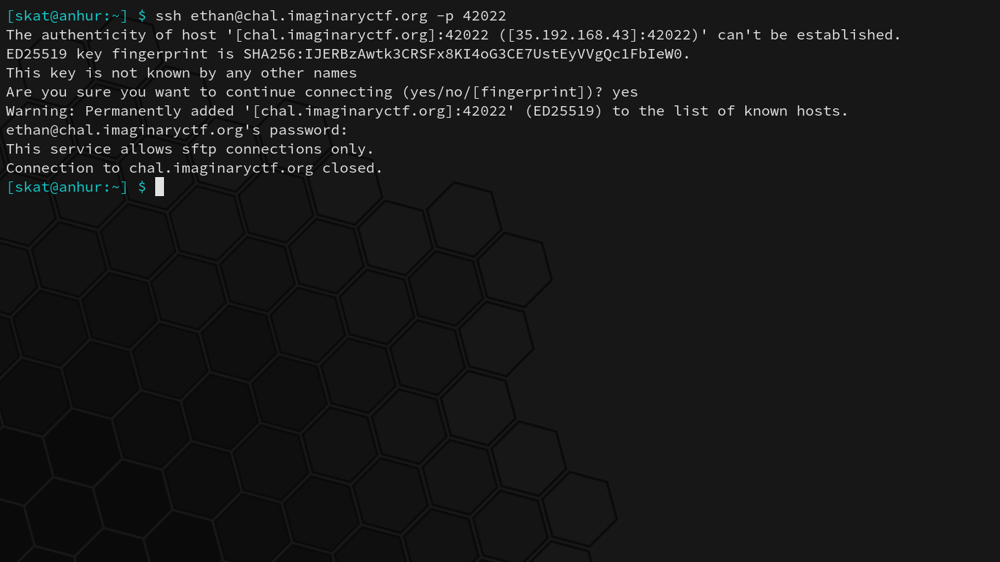

> This service allows sftp connections only.

SFTP (**S**SH **F**ile **T**ransfer **P**rotocol) is a secure form of FTP built on top of SSH. FTP is a simple protocol for transferring files and is not made with security in mind; there is no encryption. SSH is a protocol that aims to tackle the security problem by establishing a secure connection between two nodes. Thus, FTP extended with SSH provides a secure way to transfer files over a potentially insecure link.

Because the service allows SFTP connections only, we advance by using an SFTP client to connect using the same information. Here, I use the BSD SFTP client to connect:

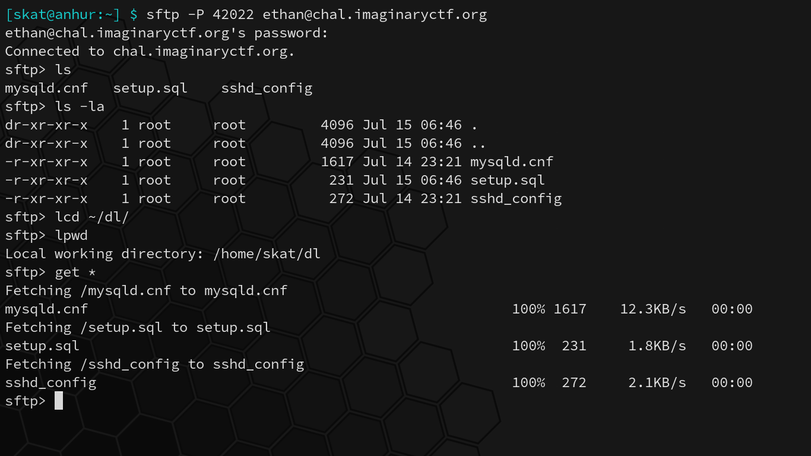

Immediately, it appears that there are 3 readable files: `mysqld.cnf`, `setup.sql`, and `sshd_config`. Additionally, it appears that the directory and all files within it are owned by root and we do not have any privileges to modify or create new or existing files in this directory. We're in what appears to be the "root" directory, and we have no way out yet:

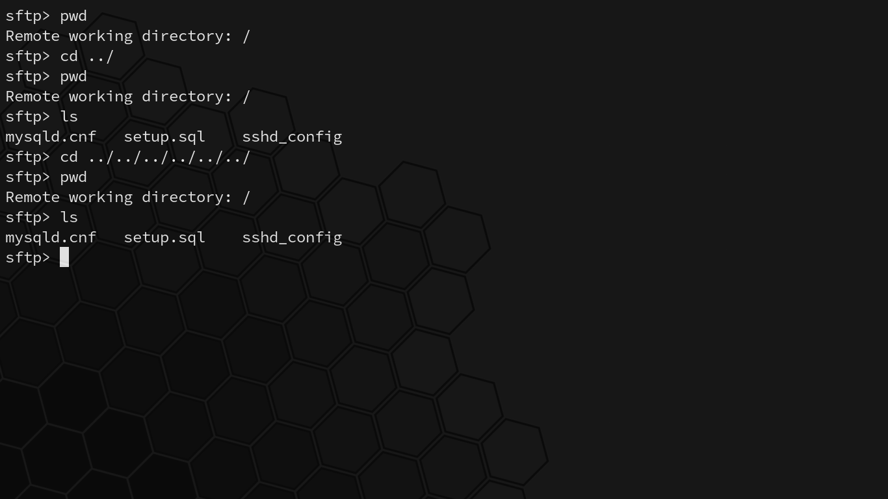

In case the filenames of `mysqld.conf`, `setup.sql`, and `sshd_config` were not apparent, these files detail the MySQL daemon configuration, the setup and structure of an SQL database, and the configuration of the SSH daemon:

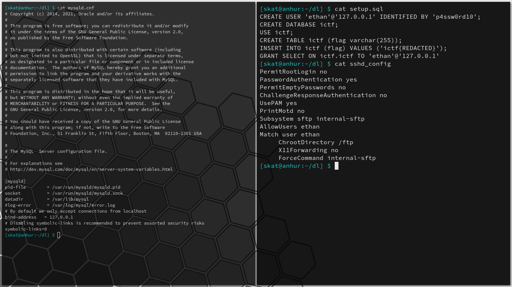

These are all fairly standard and restrictive configurations. Symbolic links, a common attack vector, are even explicitly disabled. The user we are logged in as is SFTP chroot jailed, so what is `/ftp` on the system appears to be `/` to the user's jail and we can go no higher.

However, these configurations tell us something important: there is a MySQL server bound to 127.0.0.1, the localhost. This MySQL server is not accessible from the outside world and can only be accessed within a local context. The MySQL server contains the secret flag we're after. Bypass the SFTP jail to access the MySQL server within a local context, run a query to read from the protected database, and we'll leak the flag.

The thing about SSH is that it's so much more than just a secure shell. SSH provides a medium for file transfer, proxies, tunnels, and more, including an important networking concept: port forwarding. Port forwarding is typically made possible through NAT (**n**etwork **a**ddress **t**ranslation) and involves mapping an "outer" (typically public-facing) address:port to an "inner" (typically internal-facing) address:port in order to allow outside access to inside applications residing on internal machines within a network.

The idea is that we can forward connections from an arbitrary port on our own device to 127.0.0.1:3306 on chal.imaginaryctf.org through SSH. Thus, while the "secure shell" feature of SSH is restricted and "file transfer" feature is jailed, port forwarding still works and we can appear to access the MySQL database in a local (to its perspective) context:

```
$ ssh -p 42022 -N -L 3306:127.0.0.1:3306 ethan@chal.imaginaryctf.org
```

This command connects to `chal.imaginaryctf.org` on port `42022` using `ethan`'s account. `-N` means that we will not execute remote commands; without it, we'd get our connection terminated and the same "sftp only" message as before. `-L` signifies that we're performing local port forwarding as opposed to remote port forwarding; local port forwarding creates an outgoing tunnel from the local device to the remote device, while remote port forwarding creates an outgoing tunnel from the remote device to the local device.

Once the tunnel has been established, we can connect to the SQL database as if it were localhost and leak the flag:

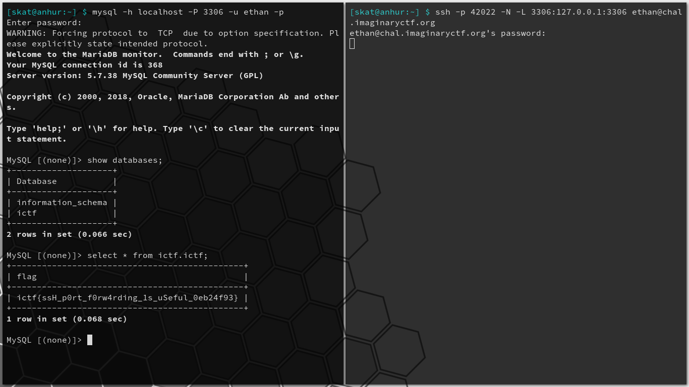

Very cool challenge. As someone who specializes network security, it's always great to see real networking concepts, misconfigurations, vulnerabilities, and exploits in the CTF scene. By recognizing an oversight in configured restrictions and utilizing lesser-known features of a well-known protocol, we were able to bypass security restrictions to leak data from a database.

## forensics/tARP

*Challenge written by Eth007.*

> It helps to have a rain tarp when there's bad weather.

Files: `tarp.pcapng`

Checksum (SHA-1):

```
3cb62d7136be8ca3ad2838c2fd2e1358dc570c63  tarp.pcapng
```

To start, we can begin with a cursory analysis of the given pcapng file:

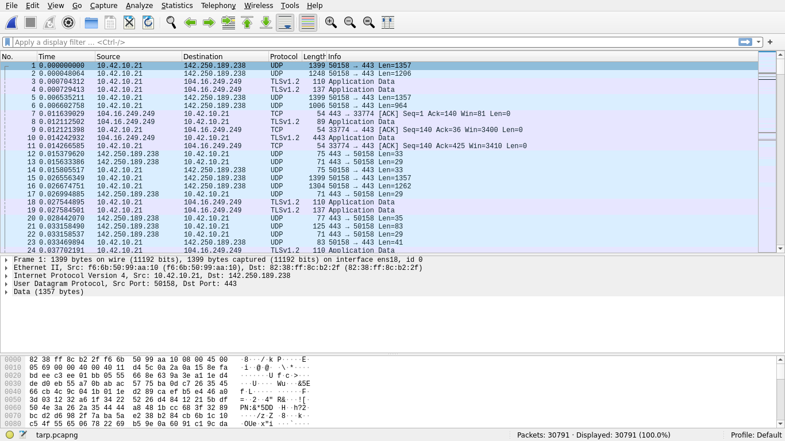

There are 30791 frames in the pcapng with the bulk of them being QUIC (**Q**uick **U**DP **I**nternet **C**onnections) and ARP (**A**ddress **R**esolution **P**rotocol). 22137 (71.89%) of these contain IPv4 data, 20456 (92.41%) of which are UDP and the remainder being TCP.

Scrolling through the pcapng, something interesting becomes apparent amid a sudden rapid torrent of ARP frames:

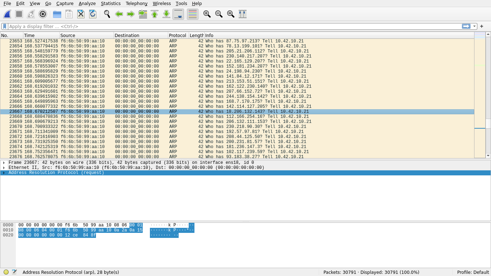

The frame destinations being `00:00:00:00:00:00` may look strange at first, but this is actually rather standard for ARP and is an acceptable broadcast address in addition to the also common `FF:FF:FF:FF:FF:FF`, depending on the specific implementation; this is not abnormal. What *is* abnormal, however, are (1) the seeming randomness of the target IPs that `F6:6B:50:99:AA:10` are trying to resolve, (2) the speed at which the frames are being transmitted, and (3) the lack of responses to these ARP requests.

A closer inspection of some of these frames reveals what appears to be plaintext data:

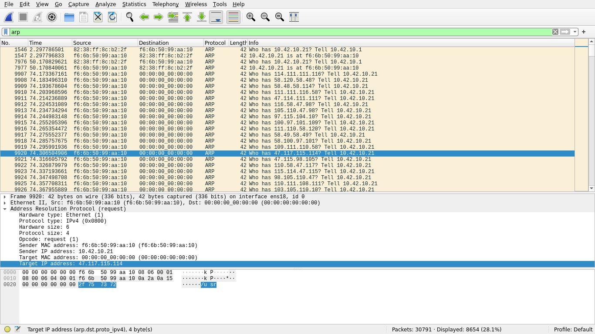

The target IP address of this ARP request, `2F 75 73 72`, translates to `/usr` in ASCII. Indeed, scrolling through these frames makes it clear that some sort of data is being transmitted, hidden in the target IPs of ARP requests originating from this host:

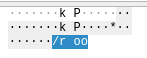

Curious to explore this, an attack plan is devised: read all broadcasted ARP frames originating from `F6:6B:50:99:AA:10` and write the last 4 bytes of each frame (the target IP) to a buffer, and finally write the buffer to a file for further analysis. My tool of choice for quick scripting like this is, as usual, Python:

```python
#!/usr/bin/env python3

from scapy.all import *

def main():

	frames = rdpcap("./tarp.pcapng")
	arp = [f for f in frames if ARP in f and
		f.src == "f6:6b:50:99:aa:10" and f.dst == "00:00:00:00:00:00"]

	data = b""

	for f in arp:
		data += bytes(f.payload)[-4:]

	with open("./output.bin", "wb") as f:
		f.write(data)

	print("Data written to ./output.bin")

if __name__ == "__main__":
	main()
```

Running this script and then carving the resultant file, sure enough, finds a PNG:

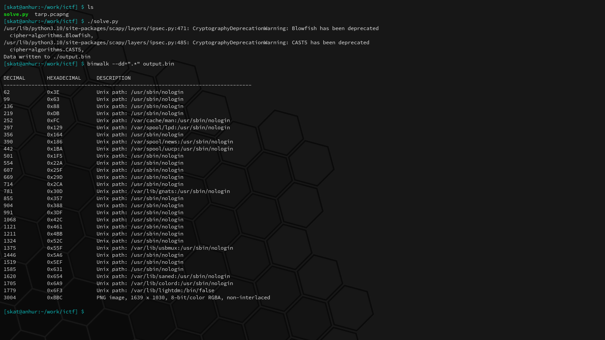

This PNG, however, cannot be viewed quite yet due to a CRC error in the IEND chunk. I can already tell from experience that this is usually due to some extra data in the IEND chunk, probably from some subsequent frames unrelated to the PNG:

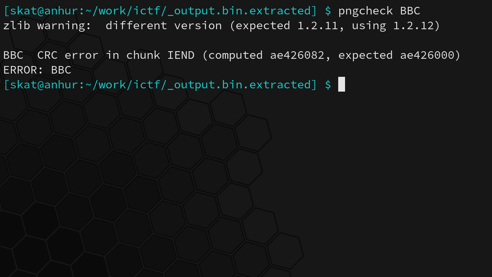

Viewing the PNG's IEND chunk under a hex editor, we can see that there are indeed 4 extra bytes following the true end of the PNG. Removal of these bytes result in the computed CRC matching the expected CRC, and the PNG can now be viewed normally:

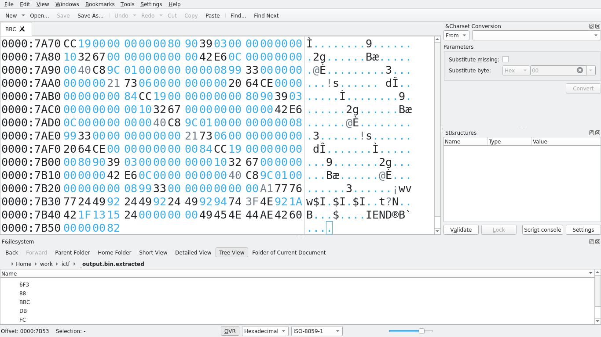

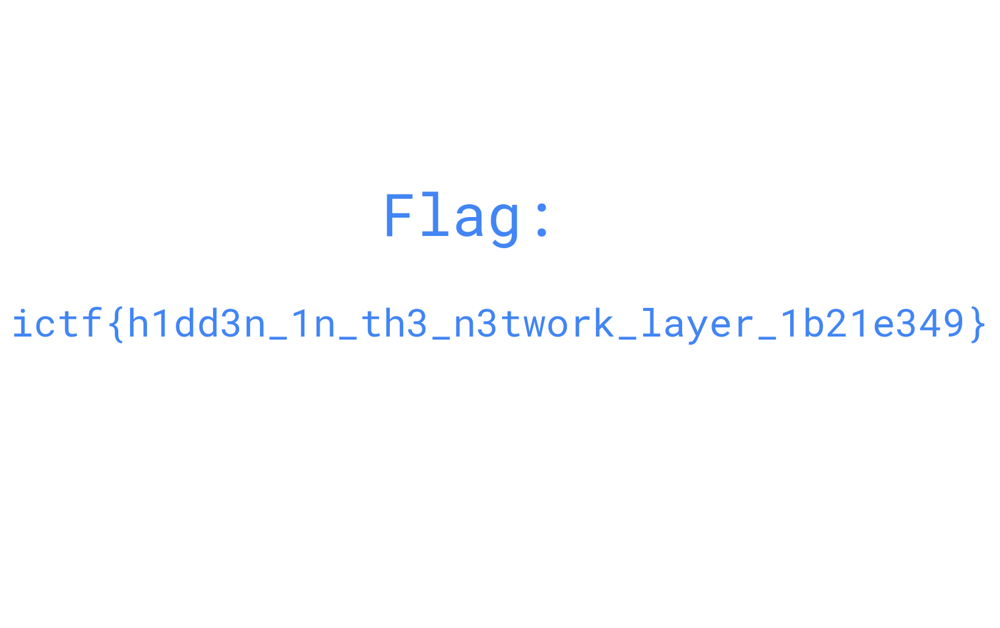

This was a very cool challenge and it's definitely not unheard of in the real world to hide data in other protocols! I love seeing networking anywhere in CTFs, so this challenge was a lot of fun to do. By analyzing a pcapng and noticing an irregularity in ARP frames, we quickly extracted, analyzed, and viewed data discreetly embedded in a link layer (layer 2) protocol.

## crypto/otp

*Challenge written by Eth007.*

> Encrypt your messages with our new OTP service. Your messages will never again be readable to anyone.
>
> `nc otp.chal.imaginaryctf.org 1337`

Files: `otp.py`

Checksum (SHA-1):

```
9543af6baf0db5286ce756e5fe47f7686b999030  otp.py
```

Before beginning, it's necessary to understand what OTP is. OTP is an encryption technique that requires a pre-shared key of equal or greater length than its message, which is used to encrypt or decrypt each unit of data in a stream. The one-time pad gets its name from cryptographers of old who would write these secret keys onto single-use pads of paper.

Modern OTP encrypts plaintext bits with bits from a pre-shared key using an XOR (exclusive-or) operation. An XOR operation, also represented by the symbol $$\oplus$$, outputs a "1" if and only if one of the arguments is a "1," but not both.

As an example, suppose that I wanted to send you a message. We would first have a pre-shared key that is **randomly generated,** and I cannot stress enough that ***it is extremely important that the key is randomly generated.***

Suppose we both know the key to be: 11010101 00101010 11100101 01001010 11101000. This is pre-shared.

Now, I will send you the ciphertext through the air: 10011101 01001111 10001001 00100110 10000111. Even if an attacker were to intercept this, they cannot read it without the pre-shared key.

You receive the ciphertext and perform an XOR operation to recover the plaintext:

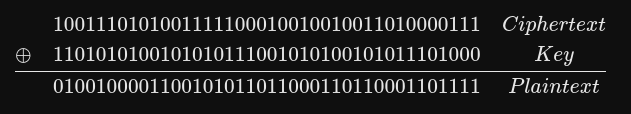

01001000 01100101 01101100 01101100 01101111 is "Hello" in ASCII.

In order to ensure OTP's unbreakability, the following four conditions must be met simultaneously:

> 1. The key must be at least as long as the plaintext.
> 2. The key must be random (uniformly distributed in the set of all possible keys and independent of the plaintext), entirely sampled from a non-algorithmic, chaotic source such as a hardware random number generator. It is not sufficient for OTP keys to pass statistical randomness tests as such tests cannot measure entropy, and the number of bits of entropy must be at least equal to the number of bits in the plaintext. For example, using cryptographic hashes or mathematical functions (such as logarithm or square root) to generate keys from fewer bits of entropy would break the uniform distribution requirement, and therefore would not provide perfect secrecy.
> 3. The key must never be reused in whole or in part.
> 4. The key must be kept completely secret by the communicating parties.
>
> \- Wikipedia

With a foundational understanding of OTP out of the way, we can now discuss the CTF challenge. Reading the given source code shows a homemade OTP implementation:

```python
#!/usr/bin/env python3

from Crypto.Util.number import long_to_bytes, bytes_to_long
import random
import math

def secureRand(bits, seed):
  jumbler = []
  jumbler.extend([2**n for n in range(300)])
  jumbler.extend([3**n for n in range(300)])
  jumbler.extend([4**n for n in range(300)])
  jumbler.extend([5**n for n in range(300)])
  jumbler.extend([6**n for n in range(300)])
  jumbler.extend([7**n for n in range(300)])
  jumbler.extend([8**n for n in range(300)])
  jumbler.extend([9**n for n in range(300)])
  out = ""
  state = seed % len(jumbler)
  for _ in range(bits):
    if int(str(jumbler[state])[0]) < 5:
      out += "1"
    else:
      out += "0"
    state = int("".join([str(jumbler[random.randint(0, len(jumbler)-1)])[0] for n in range(len(str(len(jumbler)))-1)]))
  return long_to_bytes(int(out, 2)).rjust(bits//8, b'\0')

def xor(var, key):
  return bytes(a ^ b for a, b in zip(var, key))

def main():
  print("Welcome to my one time pad as a service!")
  flag = open("flag.txt", "rb").read()
  seed = random.randint(0, 100000000)
  while True:
    inp = input("Enter plaintext: ").encode()
    if inp == b"FLAG":
      print("Encrypted flag:", xor(flag, secureRand(len(flag)*8, seed)).hex())
    else:
      print("Encrypted message:", xor(inp, secureRand(len(inp)*8, seed)).hex())

if __name__ == "__main__":
  main()
```

This program reads the flag and then encrypts it, and then allows you to either get the encrypted flag or enter a plaintext and see its encrypted counterpart. While the seed stays constant throughout a running instance of the program, the keys continue to change seemingly randomly:

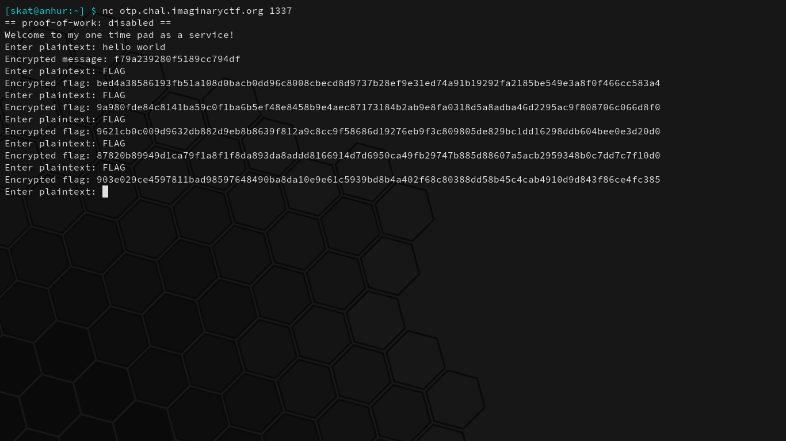

At first glance, it may not be apparent what the vulnerability is. One's eye may pop out at the jumbler. A keen eye will be attracted to this specific section of the key generation code:

```python
if int(str(jumbler[state])[0]) < 5:
  out += "1"
else:
  out += "0"
```

If the first digit of a chosen number in the jumbler is less than 5, a "1" bit is appended to the key. Otherwise, a "0" bit is appended. This seems okay until you remember that numbers cannot start with 0, so while 4 possible digits can create a "1," 5 possible digits can create a "0." This will, however, not create a 44.4%/55.5% split in probability for reasons that will be explained in a moment. There may be a bias in key generation here, which we should explore more deeply.

In order to better determine whether or not a bias exists in key generation, I modified the source code to analyze the probability of any given bit being a "1" in 10000 keys:

```python
#!/usr/bin/env python3

from Crypto.Util.number import long_to_bytes, bytes_to_long
import random
import math

def secureRand(bits, seed):

	jumbler = []
	jumbler.extend([2**n for n in range(300)])
	jumbler.extend([3**n for n in range(300)])
	jumbler.extend([4**n for n in range(300)])
	jumbler.extend([5**n for n in range(300)])
	jumbler.extend([6**n for n in range(300)])
	jumbler.extend([7**n for n in range(300)])
	jumbler.extend([8**n for n in range(300)])
	jumbler.extend([9**n for n in range(300)])

	out = ""
	state = seed % len(jumbler)

	for _ in range(bits):

		if int(str(jumbler[state])[0]) < 5:
			out += "1"
		else:
			out += "0"

		state = int("".join([str(jumbler[random.randint(0, len(jumbler)-1)])[0] for n in range(len(str(len(jumbler)))-1)]))

	return out

def main():

	# A random string in flag.txt will suffice.
	flag = open("flag.txt", "rb").read()
	seed = random.randint(0, 100000000)

	print("Generating samples...")
	samples = [secureRand(len(flag)*8, seed) for _ in range(10000)]
	probOne = [0 for _ in range(len(samples[0]))]  # Probability of a bit in the key being a 1.

	print("Analyzing...")
	for sample in samples:
		for i, bit in enumerate(sample):
			if bit == "1":  probOne[i] += 1

	for i, stat in enumerate(probOne):
		print("Bit %d probability of being '1' is %.2f%%" % (i, stat/len(samples) * 100))

if __name__ == "__main__":
	main()
```

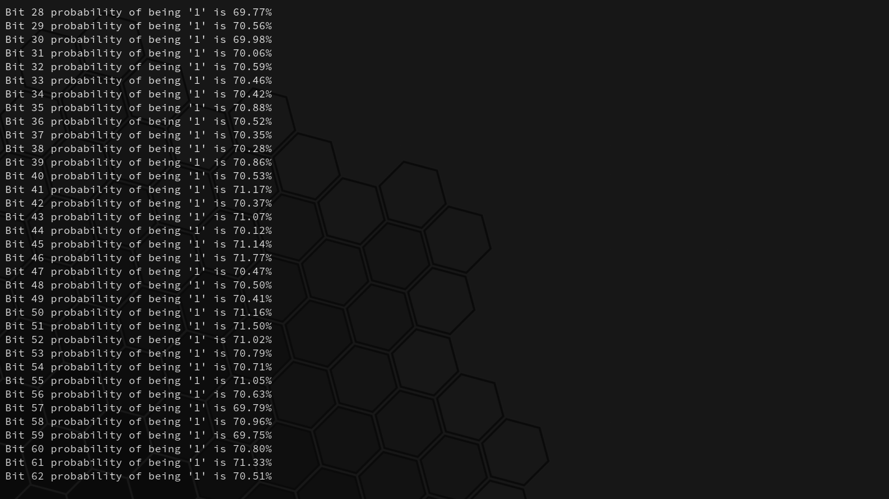

Interesting. There's a 70% probability of any given bit in the key being a "1," contrary to our earlier estimate of 44.4%. This has to do with the fact that we're not simply generating a number from 1-9 (inclusive) and checking whether or not it's less than 5, but rather that we're selecting the first digit in a chosen number from a set of numbers: the jumbler.

```python
jumbler = []
jumbler.extend([2**n for n in range(300)])
jumbler.extend([3**n for n in range(300)])
jumbler.extend([4**n for n in range(300)])
jumbler.extend([5**n for n in range(300)])
jumbler.extend([6**n for n in range(300)])
jumbler.extend([7**n for n in range(300)])
jumbler.extend([8**n for n in range(300)])
jumbler.extend([9**n for n in range(300)])
```

[Benford's Law](https://en.wikipedia.org/wiki/Benford's_law) explains this phenomenon. The leading (first) digit in any given number in a real number set is likely to be small. The distribution of first digits according to Benford's Law looks like so:


P(d) from d in {1,..,9} are 30.1%, 17.6%, 12.5%, 9.7%, 7.9%, 6.7%, 5.8%, 5.1%, and 4.6%, respectively, as per the probability equation:

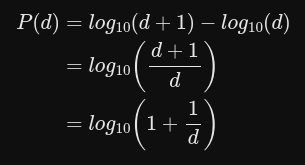

Graph, numbers, and equations courtesy of Wikipedia.

When the digits that can create a "1" bit in the key are 1, 2, 3, and 4, the sum probability of a "1" bit being created in the key are 30.1% + 17.6% + 12.5% + 9.7% = 69.9%. This explains our findings from our analysis of 10000 samples earlier.

We've discovered a violation of rule 2 of unbreakable OTP, meaning that this implementation of OTP can be cracked:

> 2. The key must be random (uniformly distributed in the set of all possible keys and independent of the plaintext), entirely sampled from a non-algorithmic, chaotic source such as a hardware random number generator.

As the key is not truly randomly generated, the ciphertexts, therefore, are not either. We can simply gather a large number of flag ciphertext samples from the server, compute the probabilities of each individual bit to form a single binary string, and then XOR it with 1s to retrieve the flag. This is easily automated with pwntools in Python:

```python
#!/usr/bin/env python3

from pwn import *

def main():

	target = remote("otp.chal.imaginaryctf.org", 1337)

	log.info("Gathering samples...")
	samples = []

	for i in range(100):

		target.recvuntil(b"plaintext: ")
		target.sendline(b"FLAG")

		data = target.recvline().decode("utf-8").split()[-1]
		log.info("Received sample: %s" % data)

		samples.append(bin(int(data, 16))[2:].zfill(len(data)*4))

	probOne = [0 for _ in range(len(samples[0]))]

	log.info("Analyzing...")
	for sample in samples:
		for i, bit in enumerate(sample):
			if bit == "1":  probOne[i] += 1

	binary = ""

	for stat in probOne:
		if stat/len(samples) > 0.5:
			binary += "1"
		else:
			binary += "0"

	dataBytes = [int(binary[i:i+8], 2) for i in range(0, len(binary), 8)]
	flag = "".join([chr(b ^ 0xFF) for b in dataBytes])

	log.info("Flag: %s" % flag)

if __name__ == "__main__":
	main()
```

Upon running the script, we begin capturing samples:

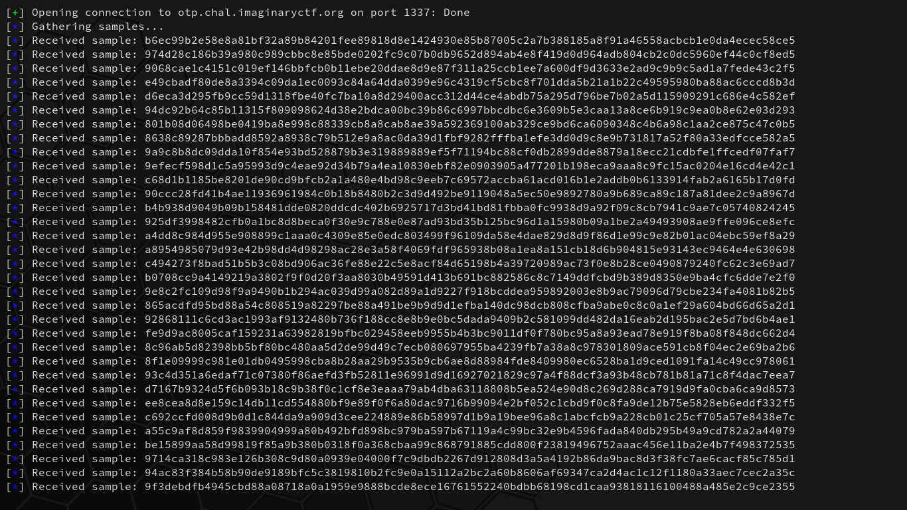

After 100 collected samples, our script computes the most common bits for each position and then creates a single binary string with the higher discovered probability bits. The binary string is then converted to their respective bytes as integers and then XORed and converted to ASCII by 1s:

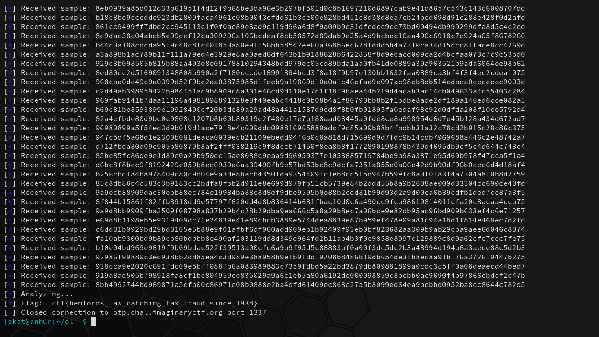

What a lovely and deeply satisfying challenge. By forming an important foundational understanding of OTP and analyzing the given code, we discovered a bias in key generation and found that it violates the randomness rule of uncrackable OTP implementation, eventually leading to recovering the flag. We've successfully cracked the encryption.
